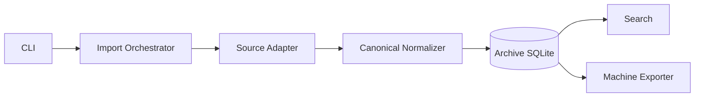

# WeArchive

Local-first WeChat chat archive, parsing, export and analysis toolkit for personal data.

> **Project status:** design-first / early development.  
> **Initial platform target:** Windows 10/11 + WeChat 4.x.  
> **Development rule:** documentation under `docs/` is the source of truth; implementation must follow documented requirements and architecture.

## Why WeArchive

WeArchive is intended to build a durable personal archive of the user's own local WeChat data for machine processing, scripting and LLM/Harness analysis.

The project is not centered on one extraction trick, one client version, or human-facing chat rendering. Its long-term value is the normalized archive and stable semantic export contract:

```text
Local source
    ↓
Source adapter
    ↓
Canonical normalization + provenance
    ↓
Local archive
    ↓
Search / selective machine export
    ↓
JSONL + identity/conversation catalogs
```

Upstream formats may change. Stable IDs, message semantics, archive behavior and export paths should remain stable.

## Documentation first

Read these before writing code:

| Document | Purpose |
|---|---|
| [`docs/PRD.md`](docs/PRD.md) | Product definition, functional/non-functional requirements and milestone acceptance criteria |
| [`docs/EXPORT_PRD.md`](docs/EXPORT_PRD.md) | Phase 1 selective export package, stable folder naming, identities, conversations and collections |
| [`docs/MESSAGE_SCHEMA.md`](docs/MESSAGE_SCHEMA.md) | Canonical message envelope, normalized message types, reply/link/app-share/forwarded/unknown semantics |
| [`docs/ARCHITECTURE.md`](docs/ARCHITECTURE.md) | Technical architecture, adapter/normalizer/archive/export boundaries, diagnostics and provenance |
| [`docs/DATA_MODEL.md`](docs/DATA_MODEL.md) | Canonical archive entities, message semantics, identity, deduplication and schema evolution |
| [`docs/ROADMAP.md`](docs/ROADMAP.md) | Milestones M0–M5 and release progression |
| [`docs/DEVELOPMENT.md`](docs/DEVELOPMENT.md) | Rules requiring requirements/docs to precede implementation |

Major architectural decisions are recorded in `docs/adr/`.

## Current product decisions

1. **Machine-first export** — exported data is for scripts, LLMs and Harness workflows, not human chat viewing.
2. **Text/metadata only in Phase 1** — no image, audio, video or transferred-file binaries are preserved as part of the product goal.
3. **JSONL timelines** — one logical message/event per line.
4. **Stable folder IDs** — `u_<id>` for direct chats and `g_<id>` for groups; mutable names never define physical paths.
5. **Separate identity catalogs** — latest remark is the default display name; if no remark exists, display name stays blank.
6. **Canonical message envelope** — downstream consumers read stable semantic fields rather than WeChat-specific XML/type internals.
7. **Links are structured** — locally obtainable original URLs and app-share metadata are retained when available.
8. **Unknown records are preserved** — unsupported types produce `unknown` events and diagnostics rather than silent loss.
9. **No derived LLM layer** — no mandatory chunks/summaries/OCR/ASR layer in Phase 1.
10. **Requirements before code** — docs remain authoritative.

## Canonical export shape

```text
wechat-export/
├─ manifest.json
├─ identities.yaml
├─ conversations.yaml
├─ collections.yaml
└─ chats/
   ├─ direct/
   │  └─ u_<stable-id>/
   │     └─ <year>/
   │        └─ <year>-<month>.jsonl
   └─ groups/
      └─ g_<stable-id>/
         └─ <year>/
            └─ <year>-<month>.jsonl
```

See [`docs/EXPORT_PRD.md`](docs/EXPORT_PRD.md).

## Canonical message model

Every timeline record follows the same conceptual structure:

```text
Message
├─ common envelope
│  ├─ id
│  ├─ conversation_id
│  ├─ sender_id
│  ├─ time
│  └─ type
├─ text        # LLM/search-first semantic representation
├─ payload     # type-specific structured semantics
├─ reply_to    # relationship + quote snapshot when available
└─ source      # provenance/reprocessing metadata
```

Normalized Phase 1 types include:

```text
text, image, voice, video, file, link, app_share, mini_program,
forward_bundle, location, contact_card, system, revoke,
red_packet, transfer, emoji, unknown
```

See [`docs/MESSAGE_SCHEMA.md`](docs/MESSAGE_SCHEMA.md).

## Target architecture



There is intentionally no Phase 1 binary-media archive.

See [`docs/ARCHITECTURE.md`](docs/ARCHITECTURE.md).

## Roadmap

Current priority is **M0: Product foundation**.

M0 uses fixture/mock sources first so the archive model, canonical message schema, stable identities, export contract, idempotency, provenance and diagnostics are stable before a real client-specific adapter defines the product.

```text
M0  Foundation + canonical schemas
 ↓
M1  Windows local-source adapter
 ↓
M2  Message semantic completeness
 ↓
M3  Search and retrieval
 ↓
M4  Harness-oriented workflows
 ↓
M5  Product/configuration experience
```

See [`docs/ROADMAP.md`](docs/ROADMAP.md).

## Planned CLI surface

```text
wearchive doctor
wearchive sources
wearchive conversations
wearchive sync
wearchive stats
wearchive search <query>
wearchive export --conversation <stable-id-or-alias>
wearchive export --collection <collection-name>
```

Exact syntax may evolve; documented behavior and schemas are authoritative.

## Development workflow

```text
PRD requirement
    ↓
Message schema / architecture / data model / ADR
    ↓
Roadmap milestone
    ↓
GitHub Issue
    ↓
Implementation + tests
    ↓
Documentation verification
```

A feature is complete only when acceptance criteria, tests, diagnostics, provenance and documentation agree.

See [`docs/DEVELOPMENT.md`](docs/DEVELOPMENT.md) and [`AGENTS.md`](AGENTS.md).

## Privacy boundary

WeArchive is designed for personal, locally available data. Private archives, exports, raw personal datasets and secrets must not be committed to Git.

Core archive/export workflows work locally. Future external AI/provider usage, if added, must remain optional and explicit.
