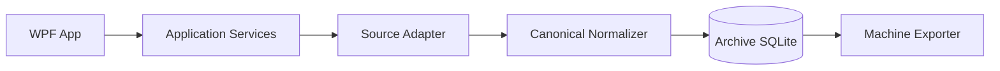

# WeArchive

Local-first WeChat chat archive, parsing, export and analysis toolkit for personal data.

> **Project status:** the Windows MVP is implemented and working.  
> **Platform:** Windows 10/11, `win-x64`, WeChat 4.x.  
> **Development rule:** documentation under `docs/` is the source of truth; implementation must follow documented requirements and architecture.

## 项目定位 / purpose

WeArchive 把你**自己**电脑上、**你自己**登录的微信聊天记录，整理成一份长期可用的本地档案，并导出成机器可读的数据集。

The project is not centered on one extraction trick, one client version, or human-facing chat rendering. Its long-term value is the normalized archive and stable semantic export contract:

```text
Local source
    ↓
Source adapter (read-only)
    ↓
Canonical normalization + provenance
    ↓
Local SQLite archive
    ↓
Selective machine export
    ↓
JSONL timelines + identity/conversation/collection catalogs
```

Upstream formats may change. Stable IDs, message semantics, archive behavior and export paths stay stable.

## What works today

- **Desktop app** — a WPF application (`WeArchive.exe`) that reports the detected WeChat installation and version, lists local accounts, lists conversations with search and a direct/group filter, previews one conversation's message count and available time range, and exports one conversation with live progress and cancellation.
- **Real WeChat 4.x source** — verified against WeChat 4.1.13.12: data-root and account discovery, SQLCipher 4 databases opened read-only, keys recovered from the running client's memory and cryptographically verified before use.
- **Canonical normalization** — `text, image, voice, video, file, link, app_share, mini_program, forward_bundle, location, contact_card, system, revoke, red_packet, transfer, emoji, unknown`, with group `<sender>:\n` prefix handling, Zstandard-compressed payloads, app-message XML, system/revoke events and reply/quote relationships.
- **Durable archive** — a SQLite archive with numbered migrations, idempotent upserts and full provenance.
- **Machine export** — monthly UTF-8 JSONL timelines under stable-ID folders plus `manifest.json`, `identities.yaml`, `conversations.yaml` and `collections.yaml`.
- **Diagnostics** — structured, counted `Fatal`/`Partial`/`Info` diagnostics for unknown types, unresolved replies, wrapper-only URLs and missing metadata.
- **Packaging** — self-contained `win-x64` publish, a portable ZIP and a Velopack `Setup.exe` with an in-app update check against GitHub Releases.

The Phase 1 Python sketch (`src/wearchive/`, `pyproject.toml`) was deleted; see [`docs/adr/0003-dotnet-wpf-mvp.md`](docs/adr/0003-dotnet-wpf-mvp.md).

## Current scope

**In scope**

- Selecting one direct chat or group chat and exporting it.
- Text and non-text message semantics without any binary media.
- File names, link/app-share/mini-program metadata and the best locally obtainable original URL.
- Reply/quote relationships, forwarded bundles, system and revoke events.
- Stable identity, conversation and export-path contracts.

**Not in scope (yet)**

- Incremental checkpoints: the schema stores them, but the MVP importer always reads the full conversation.
- Full-text search, collection selection from the UI, and archive statistics beyond conversation/message counts.
- Binary image/audio/video/file preservation, OCR and ASR.
- macOS, Linux and any hosted or multi-user variant.

## Requirements

| Item | Requirement |
|---|---|
| OS | Windows 10 or Windows 11 |
| Architecture | `win-x64` |
| WeChat | WeChat for Windows 4.x, installed, running and signed in (needed to recover the database keys) |
| .NET (development only) | .NET 10 SDK 10.0.401 or later. Released builds are self-contained and need no runtime. |

## Install from a Release

1. Open the repository's **Releases** page.
2. Download **`Setup.exe`** (Velopack installer) or the portable ZIP.
3. Run `Setup.exe` and launch **WeArchive**, or extract the ZIP and run `WeArchive.exe`.
4. Sign in to WeChat first. WeArchive reads WeChat's databases; it needs the client running to recover the database keys.

The MVP releases are **not code-signed**, so Windows SmartScreen may warn on first run.

## Run and export

1. Start WeChat and sign in.
2. Start WeArchive. The environment panel shows the detected WeChat version, whether the data source is available, and the current archive path and counters.
3. Pick an account if more than one is present.
4. Find a conversation in the list — use the search box (title or upstream id) and the **全部 / 单聊 / 群聊** filter.
5. Select it to preview its message count and available time range.
6. Choose the export directory and press **导出**. Progress, counters and diagnostics update live; **取消** cancels safely.
7. The result panel reports the record counts, the unknown/partial counts, the time range and the exported folder, which can be opened directly.

Press **刷新** to re-probe the source at any time. The interface labels are Chinese; the export package itself is language-neutral.

Exporting again rewrites the conversation's own folder, so a re-export can never produce duplicate timeline records.

## Export structure

```text
wechat-export/
├─ manifest.json
├─ identities.yaml
├─ conversations.yaml
├─ collections.yaml
└─ chats/
   ├─ direct/
   │  └─ u_<16-hex-stable-id>/
   │     └─ <year>/
   │        └─ <year>-<MM>.jsonl
   └─ groups/
      └─ g_<16-hex-stable-id>/
         └─ <year>/
            └─ <year>-<MM>.jsonl
```

One JSON object per line, one logical message per line. JSONL is written with the relaxed JSON encoder so CJK text stays readable. Ordering is `(canonical time, upstream order key, stable id)`.

See [`docs/EXPORT_PRD.md`](docs/EXPORT_PRD.md).

## Current product decisions

1. **Machine-first export** — exported data is for scripts, LLMs and Harness workflows, not human chat viewing.
2. **Text/metadata only in Phase 1** — no image, audio, video or transferred-file binaries are preserved.
3. **JSONL timelines** — one logical message/event per line.
4. **Stable folder IDs** — `u_<16 hex>` for direct chats and `g_<16 hex>` for groups; mutable names never define physical paths.
5. **Separate identity catalogs** — latest remark is the default display name; if no remark exists, display name stays blank. `display_name_override` is the user-maintained hook.
6. **Canonical message envelope** — downstream consumers read stable semantic fields rather than WeChat-specific XML/type internals.
7. **Links are structured** — locally obtainable original URLs and app-share metadata are retained when available.
8. **Unknown records are preserved** — unsupported types produce `unknown` events and diagnostics rather than silent loss.
9. **No derived LLM layer** — no mandatory chunks/summaries/OCR/ASR layer in Phase 1.
10. **Requirements before code** — docs remain authoritative.

## Canonical message model

Every timeline record follows the same conceptual structure:

```text
Message
├─ common envelope
│  ├─ id
│  ├─ conversation_id
│  ├─ sender_id
│  ├─ time
│  └─ type
├─ text        # LLM/search-first semantic representation
├─ payload     # type-specific structured semantics
├─ reply_to    # relationship + quote snapshot when available
└─ source      # provenance/reprocessing metadata
```

Normalized Phase 1 types include:

```text
text, image, voice, video, file, link, app_share, mini_program,
forward_bundle, location, contact_card, system, revoke,
red_packet, transfer, emoji, unknown
```

`red_packet`, `transfer`, `location` and `contact_card` are modelled and tested, but a red packet is only recognised as `red_packet` when the local record explicitly identifies a WeChat red packet; otherwise such records land in `app_share` or `unknown` rather than being guessed.

See [`docs/MESSAGE_SCHEMA.md`](docs/MESSAGE_SCHEMA.md).

## Architecture



| Project | Target | Role |
|---|---|---|
| `src/WeArchive.Core` | `net10.0` | Domain, contracts, normalizer. Zero package and project references. |
| `src/WeArchive.Infrastructure` | `net10.0-windows` | WeChat adapter and compatibility code, SQLCipher, key acquisition, SQLite archive, JSONL/YAML export, fixture adapter, settings. |
| `src/WeArchive.App` | `net10.0-windows` | WPF MVVM presentation. Assembly name `WeArchive.exe`. |
| `tests/WeArchive.Tests` | `net10.0-windows` | xUnit v2 on VSTest. |

The WPF app never touches WeChat data directly, and `WeArchive.Core` never learns a WeChat version number or a WeChat type code.

There is intentionally no Phase 1 binary-media archive.

See [`docs/ARCHITECTURE.md`](docs/ARCHITECTURE.md).

## Build and develop

```powershell
dotnet restore
dotnet build -c Release
dotnet test -c Release
```

`dotnet` resolves `WeArchive.sln` from the repository root; you may name it explicitly if you
prefer. The SDK is pinned by `global.json` to .NET 10.

Publish and package (both scripts do their own self-contained `win-x64` publish):

```powershell
./scripts/pack-portable.ps1 -Version 0.1.0
./scripts/pack-velopack.ps1 -Version 0.1.0
```

`pack-portable.ps1` writes `artifacts/WeArchive-win-x64.zip`; `pack-velopack.ps1` writes
`artifacts/velopack/WeArchive-win-Setup.exe` (plus a `WeArchive-Setup.exe` copy added by the
release workflow) together with the Velopack update assets (`*.nupkg`, `releases.win.json`).

82 tests pass, including five real-WeChat integration tests that skip automatically when no usable WeChat installation is present.

See [`docs/DEVELOPMENT.md`](docs/DEVELOPMENT.md) and [`AGENTS.md`](AGENTS.md).

## Documentation first

Read these before writing code:

| Document | Purpose |
|---|---|
| [`docs/PRD.md`](docs/PRD.md) | Product definition, functional/non-functional requirements and milestone acceptance criteria |
| [`docs/EXPORT_PRD.md`](docs/EXPORT_PRD.md) | Phase 1 selective export package, stable folder naming, identities, conversations and collections |
| [`docs/MESSAGE_SCHEMA.md`](docs/MESSAGE_SCHEMA.md) | Canonical message envelope, normalized message types, reply/link/app-share/forwarded/unknown semantics |
| [`docs/ARCHITECTURE.md`](docs/ARCHITECTURE.md) | Technical architecture, adapter/normalizer/archive/export boundaries, diagnostics and provenance |
| [`docs/DATA_MODEL.md`](docs/DATA_MODEL.md) | Canonical archive entities, message semantics, identity, deduplication and schema evolution |
| [`docs/ROADMAP.md`](docs/ROADMAP.md) | Milestones M0–M5 and release progression |
| [`docs/DEVELOPMENT.md`](docs/DEVELOPMENT.md) | Rules requiring requirements/docs to precede implementation |

Major architectural decisions are recorded in `docs/adr/`.

## Development workflow

```text
PRD requirement
    ↓
Message schema / architecture / data model / ADR
    ↓
Roadmap milestone
    ↓
GitHub Issue
    ↓
Implementation + tests
    ↓
Documentation verification
```

A feature is complete only when acceptance criteria, tests, diagnostics, provenance and documentation agree.

## Roadmap

M0 is complete, and this MVP delivered the first slice of M1. What M1 still does **not** have: incremental checkpoints and full partition-coverage reporting.

```text
M0  Foundation + canonical schemas            [complete]
 ↓
M1  Windows local-source adapter              [MVP slice delivered]
 ↓
M2  Message semantic completeness             future
 ↓
M3  Search and retrieval                      future
 ↓
M4  Harness-oriented workflows                future
 ↓
M5  Product/configuration experience          future
```

See [`docs/ROADMAP.md`](docs/ROADMAP.md).

## Current limitations

- One conversation per export; batch and collection selection are not in the UI yet.
- Every export re-reads the whole conversation from the source; checkpoints are stored in the schema but not used.
- Search over the archive is not implemented.
- Red packets are only recognised when the local record explicitly identifies one.
- Exporting requires the WeChat client to be running and signed in, because the database keys are recovered from its memory.
- Reading the WeChat data root and account directories is currently read-only; WeArchive never writes to, renames or deletes anything under it.
- Releases are unsigned, so SmartScreen may warn on first run.

## Privacy boundary

WeArchive is designed for personal, locally available data, and it is read-only towards WeChat.

- Database keys are recovered from the running WeChat process and are **never** persisted, logged or exported.
- No code injection, hooking, API patching or debugger attachment is used.
- Decrypted copies exist only in `%LOCALAPPDATA%\WeArchive\scratch` for the duration of a read and are deleted when the adapter is disposed.
- Chat content is never written to logs.
- Private archives, exports, raw personal datasets and secrets must not be committed to Git (`.probe/` and export outputs are git-ignored).

Core archive/export workflows work fully offline. Any future external AI/provider usage must remain optional and explicit.
