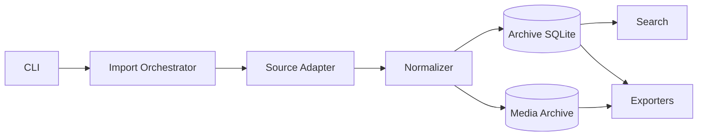

# WeArchive

Local-first WeChat chat archive, parsing, export and analysis toolkit for personal data.

> **Project status:** design-first / early development.  
> **Initial platform target:** Windows 10/11 + WeChat 4.x.  
> **Development rule:** documentation under `docs/` is the source of truth; implementation must follow documented requirements and architecture.

## Why WeArchive

WeArchive is intended to build a durable personal archive of the user's own local WeChat data.

The project is not centered on one particular extraction trick or one client version. Its long-term product value is the normalized archive itself:

```text
Local source
    ↓
Source adapter
    ↓
Normalization + provenance
    ↓
Local archive
    ↓
Search / export / later analysis
```

Upstream formats may change. The archive model, user workflows and exports should remain stable.

## Documentation first

Start here before writing code:

| Document | Purpose |
|---|---|
| [`docs/PRD.md`](docs/PRD.md) | Product definition, user journeys, functional/non-functional requirements and milestone acceptance criteria |
| [`docs/ARCHITECTURE.md`](docs/ARCHITECTURE.md) | Technical architecture, module boundaries, data flow, adapter contract, diagnostics and provenance |
| [`docs/DATA_MODEL.md`](docs/DATA_MODEL.md) | Canonical archive entities, relationships, identity, deduplication and schema-evolution rules |
| [`docs/ROADMAP.md`](docs/ROADMAP.md) | Milestones M0–M5 and release progression |
| [`docs/DEVELOPMENT.md`](docs/DEVELOPMENT.md) | Rules that require requirements/docs to precede implementation |

Major architectural decisions will be recorded in `docs/adr/`.

## Product principles

1. **Requirements before code** — product behavior is defined in docs, not inferred from implementation.
2. **Archive first** — source collection is an input stage; the durable normalized archive is the product.
3. **Local first** — core archive/search/export workflows work offline.
4. **Read-only source boundary** — initial source adapters do not intentionally modify upstream data.
5. **Source isolation** — upstream/version-specific assumptions stay behind adapter boundaries.
6. **Provenance by default** — archived records retain source identity and import history.
7. **Incremental by default** — routine sync should avoid unnecessary full reprocessing.
8. **Explicit uncertainty** — missing or unsupported data produces diagnostics rather than silent loss.

## Target architecture



See [`docs/ARCHITECTURE.md`](docs/ARCHITECTURE.md) for the authoritative architecture.

## Roadmap

Current priority is **M0: Product foundation**.

M0 deliberately uses fixture/mock sources first so that the archive model, idempotency, provenance, migrations, exports and tests are stable before a real client-specific adapter defines the shape of the product.

High-level progression:

```text
M0  Foundation
 ↓
M1  Windows local-source adapter
 ↓
M2  Attachment/media archive
 ↓
M3  Search and retrieval
 ↓
M4  Analysis-ready workflows
 ↓
M5  Product experience / GUI
```

See [`docs/ROADMAP.md`](docs/ROADMAP.md).

## Planned CLI surface

```text
wearchive doctor
wearchive sources
wearchive conversations
wearchive sync
wearchive stats
wearchive search <query>
wearchive export <conversation> --format markdown
```

The detailed behavior is specified in the PRD; command names may evolve before 1.0.

## Development workflow

The required sequence for non-trivial work is:

```text
PRD requirement
    ↓
Architecture / data model / ADR
    ↓
Roadmap milestone
    ↓
GitHub Issue
    ↓
Implementation + tests
    ↓
Documentation verification
```

A feature is not complete merely because the code runs. It is complete when acceptance criteria, tests, diagnostics, provenance and documentation all agree.

See [`docs/DEVELOPMENT.md`](docs/DEVELOPMENT.md).

## Repository status

The repository currently contains an initial Python package/CLI skeleton and design documents. Existing implementation should be treated as provisional where it conflicts with the current docs; **docs take precedence** until the code is aligned.

## Privacy boundary

WeArchive is designed for personal, locally available data. Private archives, exports, raw personal datasets and secrets must not be committed to Git.

Future external AI/provider integrations, if added, must be optional and explicitly show the user what data leaves the local machine.
