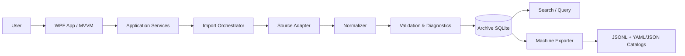
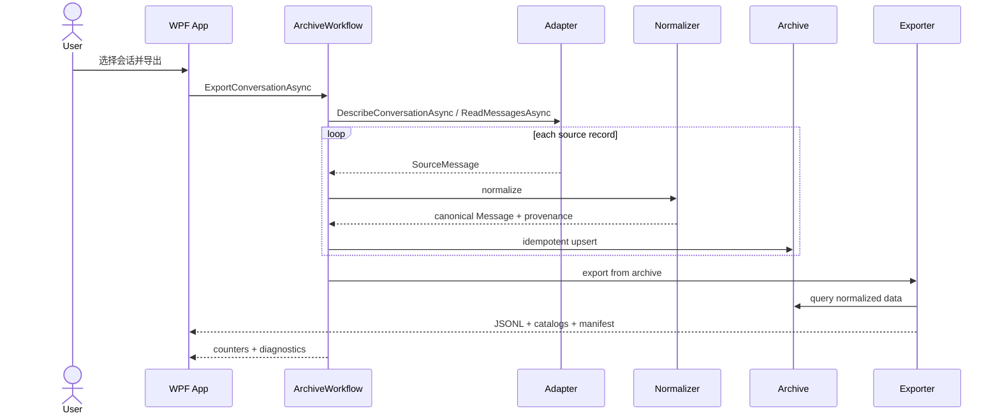
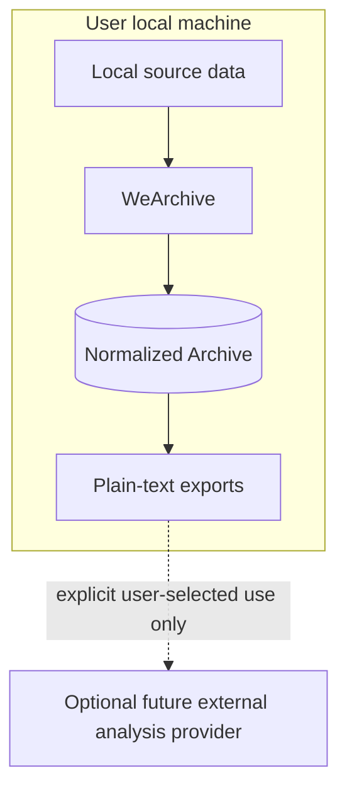

# WeArchive Technical Architecture

## 1. Architecture goals

WeArchive is optimized for long-term maintainability and machine-oriented analysis rather than human-facing chat rendering.

Key constraints:

- upstream client formats may change frequently;
- the normalized archive must remain stable across those changes;
- source-specific behavior must not leak into search/export/business logic;
- import runs must be observable, restartable and auditable;
- the shipped product is a Windows desktop application: local-first and read-only toward the source;
- Phase 1 does not preserve binary image/audio/video/file payloads;
- exported chat data is a plain-text dataset for scripts, LLMs and Harness workflows.

Normative message semantics are defined in [MESSAGE_SCHEMA.md](MESSAGE_SCHEMA.md). Normative export packaging is defined in [EXPORT_PRD.md](EXPORT_PRD.md).

## 2. Logical architecture



There is intentionally no Phase 1 media archive. Binary media/files are represented only by normalized textual events and locally available metadata such as filename or duration.

`Search / Query` is a target component: the MVP archives and exports but does not index or query.

## 3. Layering

The implementation is one .NET solution, `WeArchive.sln`, with four projects. Dependencies point in one direction only:

```text
WeArchive.App (WPF)
    ↓
WeArchive.Infrastructure
    ↓
WeArchive.Core
```

`tests/WeArchive.Tests` references `Core` and `Infrastructure`.

### 3.1 Presentation — `src/WeArchive.App`

WPF, MVVM, `net10.0-windows`, assembly name `WeArchive.exe`.

Responsibilities:

- render the environment/status panel, account selection, conversation list, conversation preview, export progress and diagnostics;
- collect user intent (conversation, output directory) and forward it to application services;
- display progress counters, cancellation and the result summary;
- never contain source-format logic and never touch WeChat data directly.

The single screen of the MVP is `MainWindow.xaml` with `MainViewModel`. The observable state (busy/cancel, progress stage and counters, result summary, diagnostics, update status) lives in the view model; the view is declarative.

### 3.2 Application / orchestration — `src/WeArchive.Core/Services`

Responsibilities:

- coordinate source adapter, normalization, archive transaction and checkpoint update;
- create import-run records;
- enforce read-only source boundaries;
- aggregate metrics and warnings;
- invoke machine-oriented exports from normalized archive data only.

Key services:

```text
SourceCatalogService   # describe source, list accounts, list conversations, describe one conversation
ImportService          # adapter -> normalizer -> archive, with diagnostics
ArchiveWorkflow        # user-facing export/import coordination and archive statistics
```

### 3.3 Source adapter layer — `src/WeArchive.Core/Abstractions`

Responsibilities:

- detect source profile/account;
- enumerate conversations;
- stream source messages/events;
- expose source/client version and freshness metadata;
- expose locally available semantic fields needed by the canonical schema;
- translate source-specific failures into typed diagnostics;
- cheaply describe one conversation so a UI can preview a selection.

The contract (`ISourceAdapter`, C#):

```csharp
public interface ISourceAdapter
{
    string AdapterName { get; }

    string AdapterVersion { get; }

    Task<SourceDescriptor> DescribeSourceAsync(CancellationToken cancellationToken);

    Task<IReadOnlyList<SourceAccount>> ListAccountsAsync(CancellationToken cancellationToken);

    Task<IReadOnlyList<SourceConversation>> ListConversationsAsync(
        string sourceProfileId,
        CancellationToken cancellationToken);

    IAsyncEnumerable<SourceMessage> ReadMessagesAsync(
        string sourceProfileId,
        string sourceConversationId,
        CancellationToken cancellationToken);

    Task<IReadOnlyList<SourceParticipant>> ListParticipantsAsync(
        string sourceProfileId,
        CancellationToken cancellationToken);

    Task<SourceConversationDetail> DescribeConversationAsync(
        string sourceProfileId,
        string sourceConversationId,
        CancellationToken cancellationToken);
}
```

`ReadMessagesAsync` is an async stream in ascending time order. A record the parser cannot interpret is still emitted with `SourceContentKind.Unknown`; it is never dropped. `DescribeConversationAsync` is the cheap path (record count, time range, participants) used for previews, and must not read message bodies.

Implementations:

- `WeArchive.Infrastructure/Fixtures/FixtureSourceAdapter` — synthetic fixture source used by the test suite.
- `WeArchive.Infrastructure/WeChat/WeChatWindowsSourceAdapter` — the real WeChat 4.x adapter.

This layer, together with the WeChat compatibility namespace below, is the only place where upstream client/version assumptions may exist.

#### 3.3.1 WeChat compatibility boundary

```text
src/WeArchive.Infrastructure/WeChat/
├─ Compatibility/     WeChat4Schema   (table names, column names, numeric type codes, conversation classification)
├─ Parsers/           WeChatContentParser, WeChatXml  (wire payloads -> source-neutral content)
├─ Crypto/            SqlCipherPageCipher  (SQLCipher 4 page format)
├─ KeyAcquisition/    ProcessMemoryReader, WcdbCipherConfigKeyAcquirer, WeChatKeySet
├─ WeChatClient.cs / WeChatDataLocator.cs / WeChatAccountReader.cs
├─ WeChatContentDecoder.cs
└─ SqlCipherDatabaseCache.cs
```

Rules:

1. Every WeChat version-specific table name, column name and numeric type code lives in `Compatibility/WeChat4Schema`. A future client version adds a sibling type in this namespace rather than editing call sites.
2. `Core` never learns a WeChat version number, a WeChat table name or a WeChat type code. If a WeChat fact must reach the domain, it arrives as an already-translated source-neutral value.
3. Key acquisition and page cryptography never leave `KeyAcquisition/` and `Crypto/`; nothing outside them knows that the databases are encrypted.
4. Decryption is materialized only into `%LOCALAPPDATA%\WeArchive\scratch` and is deleted when the adapter is disposed.

### 3.4 Normalization layer — `src/WeArchive.Core/Normalization`

Responsibilities:

- map source records into stable domain models;
- preserve stable IDs and mutable names separately;
- normalize timestamps and participant identities;
- map upstream types into canonical semantic message types;
- build `text`, `payload`, `reply_to` and `source` according to `MESSAGE_SCHEMA.md`;
- preserve unknown records instead of silently dropping them.

`MessageNormalizer` derives the canonical message and its deterministic stable IDs; `SemanticText` produces the LLM/search-first `text` for every type.

### 3.5 Validation / diagnostics — `src/WeArchive.Core/Domain/Diagnostics.cs`

Responsibilities:

- detect missing source partitions;
- detect unsupported or unknown message types;
- detect timestamp/order anomalies;
- detect duplicate logical records;
- detect unresolved reply targets;
- report partial link/app-share parsing;
- produce machine-readable warnings rather than silently losing data.

Severities are `Fatal`, `Partial` and `Info`. Diagnostics carry structured codes (for example `unknown_message_type`, `unresolved_reply_target`, `link_wrapper_url_only`, `key_acquisition_failed`, `wal_frames_rejected`) and are rolled up by `(code, source type, source subtype)` with a count, so a conversation with thousands of unparsed records yields one counted row rather than thousands. Diagnostics never carry chat content — only identifiers, upstream type codes and short engineering explanations.

### 3.6 Archive persistence — `src/WeArchive.Infrastructure/Archive`

SQLite is the system of record for normalized archive data.

Responsibilities:

- migrations;
- idempotent upserts;
- checkpoints;
- import-run audit trail;
- canonical message semantics;
- identity/conversation metadata;
- search indexes;
- integrity checks.

Phase 1 archive storage is text/metadata oriented. Binary media copies are outside scope.

The MVP ships migration 1 and records applied migrations in `schema_migrations`; the schema version is also mirrored into SQLite's `user_version`. `search indexes` is a target item — no FTS index exists yet.

### 3.7 Query and export — `src/WeArchive.Infrastructure/Export`

Search and exporters consume normalized archive models only, never upstream source files directly.

The Phase 1 exporter produces:

```text
manifest.json
identities.yaml
conversations.yaml
collections.yaml
chats/direct/<stable-id>/<year>/<year>-<MM>.jsonl
chats/groups/<stable-id>/<year>/<year>-<MM>.jsonl
```

This guarantees that downstream LLM/Harness workflows remain stable when the upstream client format changes.

## 4. Data flow



The exporter reads the archive only; it never reopens the source.

## 5. Repository structure

```text
WeArchive.sln
src/
├─ WeArchive.Core/                 (net10.0, no package or project references)
│  ├─ Abstractions/                ISourceAdapter, IArchiveStore, IDatasetExporter
│  ├─ Domain/                      CanonicalMessage, CanonicalMessageType, Conversation,
│  │                               SourceRecords, SourceMessageContent, SourceProvenance,
│  │                               ImportRun, Diagnostics, StableIds
│  ├─ Export/                      ExportModels (request, manifest, result)
│  ├─ Normalization/               MessageNormalizer, SemanticText
│  └─ Services/                    SourceCatalogService, ImportService, ArchiveWorkflow
├─ WeArchive.Infrastructure/       (net10.0-windows)
│  ├─ Archive/                     ArchiveMigrations, SqliteArchiveStore
│  ├─ Export/                      JsonlDatasetExporter, YamlCatalogs
│  ├─ Fixtures/                    FixtureSourceAdapter
│  ├─ Settings/                    SettingsStore
│  ├─ WeChat/                      adapter, compatibility, parsers, crypto, key acquisition
│  ├─ ServiceCollectionExtensions.cs
│  └─ SystemClock.cs
└─ WeArchive.App/                  (net10.0-windows, WinExe, WPF; assembly name WeArchive)
   ├─ App.xaml / App.xaml.cs
   ├─ MainWindow.xaml / MainWindow.xaml.cs
   ├─ Services/                    FolderPicker, UpdateService
   └─ ViewModels/                  MainViewModel, ConversationItemViewModel, ...
tests/
└─ WeArchive.Tests/                (net10.0-windows, xUnit v2 on VSTest)
```

Build properties are centralized in `Directory.Build.props` (C# 14, nullable, warnings-as-errors, deterministic builds) and package versions in `Directory.Packages.props` (central package management).

## 6. Adapter contract

Every adapter must provide:

- `AdapterName`;
- `AdapterVersion`;
- the upstream `SourceVersion` (and product name) through `SourceDescriptor`;
- `SourceAccount.SourceProfileId` for each locally available profile;
- stable conversation IDs (`SourceConversation.SourceConversationId`);
- stable participant IDs where available (`SourceParticipant.SourceUserId`);
- stable message/source IDs where available (`SourceMessage.SourceMessageId`);
- source timestamps (`SourceMessage.OccurredAt`);
- source partition references where applicable (`SourceMessage.SourcePartition`);
- an upstream order key (`SourceMessage.SourceOrderKey`) so a merged timeline stays stable;
- verbatim upstream type/subtype codes for provenance and diagnostics;
- explicit completeness/freshness diagnostics;
- locally obtainable semantic data for supported message types.

An adapter must be read-only towards the source. An adapter must not:

- write exports directly;
- bypass the archive model for convenience;
- hide unsupported source records;
- fabricate identities, URLs, amounts or message content;
- require binary-media preservation for Phase 1 correctness.

### 6.1 Upstream message identity

An upstream record frequently has no single stable identifier. Adapters must therefore
supply a documented composite identity strategy rather than falling back to a content hash,
because repeated identical messages are valid data:

```text
server id present -> s:<server_id>
otherwise         -> l:<partition>:<local_id>
```

The adapter hands this string to `StableIds.Message(conversationId, sourceMessageId)`. Reply
references are addressed the same way so the archive can resolve them.

## 7. Canonical message boundary

The normalizer emits the semantic contract defined by `MESSAGE_SCHEMA.md`:

```text
Message
├─ common envelope
│  ├─ id
│  ├─ conversation_id
│  ├─ sender_id
│  ├─ time
│  └─ type
├─ text
├─ payload
├─ reply_to
└─ source
```

Downstream search/export logic must not depend on upstream numeric message types or raw XML layouts.

## 8. Identity model

Stable identity and human naming are separate.

```text
stable user id (u_...)
    ├─ source user id
    ├─ latest remark
    ├─ nickname
    └─ user-maintained display_name_override
```

Default exported `display_name` uses the latest available remark. If no remark exists, it remains blank; nickname is metadata only. The user-maintained `display_name_override` wins over the generated default when it is non-empty.

Conversation physical paths use stable IDs, never mutable names.

## 9. Link/app-share normalization

The normalizer should preserve locally obtainable semantic metadata including:

- title;
- description;
- source application;
- original URL;
- wrapper/fallback URL;
- app ID;
- page path.

The architecture does not require remote webpage crawling for canonical Phase 1 export.

## 10. Incremental synchronization

Checkpoint design is adapter-owned but archive-stored.

A checkpoint may contain opaque versioned state such as:

- last stable sequence identifier;
- last imported timestamp;
- per-partition cursors;
- source snapshot fingerprints.

Rules:

1. checkpoints advance only after the corresponding archive transaction is durable;
2. replay from an older checkpoint remains idempotent;
3. adapter-version changes may explicitly invalidate checkpoints.

Status: the `source_checkpoints` table and these rules exist in the schema, but the MVP importer neither reads nor advances checkpoints. Every import is a full, idempotent re-read of the selected conversation. Incremental refresh is M1 completion work.

## 11. Error model

### Fatal

Import/export cannot safely continue.

Diagnostic severity `Fatal`.

Examples:

- archive schema unavailable;
- unsupported migration state;
- source profile cannot be initialized;
- WeChat keys cannot be recovered (`key_acquisition_failed`).

### Partial

Operation can continue but completeness is uncertain.

Diagnostic severity `Partial`.

Examples:

- one source partition unavailable or unreadable (`partition_missing`, `partition_unreadable`);
- one message type is unknown (`unknown_message_type`);
- a reply target cannot be resolved (`unresolved_reply_target`, `reply_snapshot_only`);
- app-share metadata lacks a confirmed original URL (`link_wrapper_url_only`, `link_metadata_missing`);
- a filename or voice duration is unavailable;
- a write-ahead-log frame failed verification (`wal_frames_rejected`).

### Informational

No correctness impact.

Diagnostic severity `Info`.

Examples:

- no new records;
- optional metadata unavailable;
- selected collection contains no records for a requested month.

All import runs retain structured diagnostics.

## 12. Security architecture



Core archive/export workflows do not require external network access.

### Local source confidentiality

WeChat's local databases are SQLCipher 4 encrypted (`AES-256-CBC` payloads with a
`HMAC-SHA512` page authentication tag, 4096-byte pages, 80-byte reserve). Reading them
requires a per-database key that only the running, signed-in client holds.

Rules:

1. The key is recovered **only** from the running client's own process memory, read-only
   (`PROCESS_QUERY_INFORMATION | PROCESS_VM_READ`). No code injection, hooking, API
   patching, debugger attachment or version-specific code offsets are used.
2. Every candidate key is **cryptographically verified** against a real database's page-1
   HMAC before use. A candidate that does not open a real database is discarded, so the
   implementation fails closed rather than producing plausible-looking garbage.
3. Source databases are opened read-only with `FileShare.ReadWrite`; nothing under the
   WeChat data directory is written, renamed or deleted.
4. Decrypted plaintext copies exist only transiently under
   `%LOCALAPPDATA%\WeArchive\scratch\<random>` for the duration of a read, and are deleted
   when the adapter is disposed. **No decrypted source data persists.**
5. The key is never persisted, logged or exported, and there is no key file or
   "remember my key" setting.
6. Chat content is never logged. Diagnostics carry identifiers, upstream type codes and
   short engineering explanations only.

See [adr/0005-wechat-local-key-acquisition.md](adr/0005-wechat-local-key-acquisition.md).

## 13. Architecture decisions

Major design changes must be recorded under `docs/adr/`.

Changes that require ADR consideration include:

- changing the canonical message envelope;
- changing stable identity/path strategy;
- adding binary-media persistence;
- adding remote content crawling to canonical export;
- adding a derived LLM/chunk layer;
- changing the archive system of record;
- changing how local WeChat data is accessed or decrypted.

## 14. Definition of architectural compliance

A code change is architecture-compliant when:

1. its behavior maps to a documented requirement;
2. source-specific logic stays inside adapter/compatibility boundaries;
3. normalizer output follows `MESSAGE_SCHEMA.md`;
4. search/export consume normalized archive models only;
5. mutable names never define stable identity or physical paths;
6. no decrypted source data persists: plaintext exists only transiently under
   `%LOCALAPPDATA%\WeArchive\scratch` and is removed when the adapter is disposed, and keys
   are never persisted, logged or exported;
7. new failure/unknown cases appear in diagnostics rather than disappearing;
8. new persistent fields include migration/provenance implications;
9. documentation is updated whenever behavior or architecture changes.
