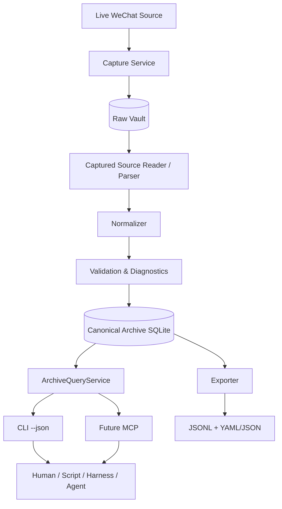

# WeArchive Technical Architecture

## 1. Architecture goals

WeArchive is optimized for long-term preservation, stable source-independent semantics, efficient machine retrieval and deterministic automation.

Key goals:

- preserve recoverable source evidence before upstream deletion/schema/key-access changes can make it unavailable;
- isolate WeChat-version-specific formats from canonical/query/export/Harness logic;
- keep `archive/wearchive.db` stable, indexed and rebuildable;
- make Harness/Agent retrieval use a bounded query API rather than Raw Vault internals or large JSONL scans;
- keep export portable and derived;
- make capture/ingest/rebuild operations observable, auditable and explicitly reliable by failure class;
- preserve stable IDs across parser upgrades and canonical rebuilds.

Normative supporting documents:

- [RAW_VAULT.md](RAW_VAULT.md) — preservation/capture/rebuild contract;
- [HARNESS.md](HARNESS.md) — Harness/query access contract;
- [DATA_MODEL.md](DATA_MODEL.md) — canonical schema/stable IDs/checkpoint direction;
- [MESSAGE_SCHEMA.md](MESSAGE_SCHEMA.md) — canonical message semantics;
- [EXPORT_PRD.md](EXPORT_PRD.md) — interchange export packaging;
- [ADR 0008](adr/0008-raw-vault-canonical-query-layers.md) — layer-separation decision.

This document describes both shipped foundations and accepted target architecture. Raw Vault, rebuild, QueryService/FTS and MCP are not yet all implemented in 0.2.x.

## 2. Logical architecture



The architecture has distinct responsibilities:

```text
Raw Vault                 preservation/recovery truth
archive/wearchive.db      canonical runtime truth
ArchiveQueryService       interactive access contract
JSONL/YAML/JSON           interchange/offline export
```

Harnesses do not normally read Raw Vault or issue raw SQL.

## 3. Layering and projects

Target dependency direction remains:

```text
WeArchive.Cli
    ↓
WeArchive.Infrastructure
    ↓
WeArchive.Core
```

`tests/WeArchive.Tests` may reference all product projects for contract/integration testing.

### 3.1 Presentation — `src/WeArchive.Cli`

Responsibilities:

- parse explicit `gh`-style commands/options;
- translate arguments into application-service requests;
- render concise human output;
- render exactly one JSON document on stdout with `--json`;
- put progress/human diagnostics on stderr;
- enforce `--quiet` / `--no-input` / exit semantics;
- never contain WeChat schema logic, Raw Vault format logic, normalization rules or query SQL.

Current shipped command family:

```text
wearchive doctor
wearchive account list
wearchive conversation list
wearchive conversation show <id-or-alias>
wearchive sync --conversation <id-or-alias>
wearchive export --conversation <id-or-alias>
```

Accepted target additions include:

```text
wearchive capture
wearchive sync --collection <name>
wearchive rebuild
wearchive message list ...
wearchive search ...
wearchive context ...
```

Exact commands become shipped contract in `CLI.md` only when implemented.

### 3.1.1 CLI process contract

```text
stdout  final result; with --json exactly one JSON document
stderr  progress, warnings and human diagnostics
0       operation completed under documented semantics
1       runtime/operation failure, including Fatal diagnostics
2       usage/configuration validation failure
130     cancellation/user interrupt
```

`--no-input` never prompts. CLI JSON DTOs expose stable product contracts, never raw WeChat table names, Raw Vault physical internals or SQLite implementation details.

### 3.1.2 Future MCP transport

A future stdio MCP server is an optional transport adapter over the same application/query services.

It MUST NOT:

- directly parse Raw Vault source artifacts;
- implement a separate query engine;
- expose arbitrary SQLite SQL as the primary product contract;
- embed an AI provider into the core archive pipeline.

## 4. Preservation layer — Raw Vault

### 4.1 Capture boundary

The capture layer is the only component that needs live-source-specific acquisition/decryption/snapshot logic.

Target responsibilities:

- discover supported source accounts/artifacts;
- acquire/decrypt source data read-only;
- establish consistent source snapshots (including SQLite/WAL concerns);
- publish immutable logical generations;
- record artifact checksums, source/client version and completeness diagnostics;
- advance capture checkpoints only after successful Raw Vault publication.

Capture minimizes semantic transformation. Unknown fields are preserved rather than discarded because the current parser does not understand them.

### 4.2 Raw Vault properties

Raw Vault is the archival source of truth and non-reproducible preserved evidence.

Rules:

1. published generations are logically immutable;
2. upstream disappearance does not delete older generations;
3. capture does not intentionally modify WeChat data;
4. Raw Vault recovery does not depend on reacquiring the original WeChat database key;
5. WeChat DB keys are never persisted;
6. physical deduplication is allowed if it preserves logical-generation immutability;
7. source coverage/completeness is explicit.

See [RAW_VAULT.md](RAW_VAULT.md).

## 5. Source compatibility and captured-source readers

WeChat version-specific behavior stays in Infrastructure compatibility code.

Conceptual organization:

```text
WeArchive.Infrastructure/WeChat/
├─ Compatibility/        version-specific table/column/type assumptions
├─ Crypto/               SQLCipher/page cryptography
├─ KeyAcquisition/       live read-only key acquisition
├─ Capture/              consistent live source -> Raw Vault
├─ Readers/              Raw Vault/source-format -> SourceMessage
├─ Parsers/              source payload -> source-neutral semantics
└─ discovery/client/data-locator support
```

A reader is selected using generation/source-format metadata. Different generations may require different readers:

```text
WeChat 4.x generations -> WeChat4CapturedSourceReader
future format          -> compatible future reader
                         ↓
                     Normalizer
```

Reader implementation versions are not identity namespaces. Stable identity uses the logical source/adapter family and preserved source IDs.

## 6. Normalization layer — `src/WeArchive.Core/Normalization`

Responsibilities:

- map captured source records into stable domain models;
- preserve stable IDs separately from mutable names;
- normalize timestamps/participants/message types;
- build `text`, `payload`, `reply_to` and `source` according to `MESSAGE_SCHEMA.md`;
- emit `unknown` rather than silently dropping unsupported source records;
- remain independent of Raw Vault physical storage layout.

Parsing/normalization can evolve and historical Raw Vault evidence can be replayed with improved readers/parsers.

## 7. Canonical archive — `src/WeArchive.Infrastructure/Archive`

`archive/wearchive.db` is the **operational system of record**, not the preservation source of truth.

Responsibilities:

- schema migrations;
- deterministic stable IDs;
- idempotent canonical upserts;
- conversation-scoped publication semantics;
- import-run audit data;
- canonical message semantics/provenance;
- identity/conversation metadata;
- query-supporting indexes;
- integrity checks;
- target ingest checkpoints.

The canonical database is intentionally rebuildable from Raw Vault.

A parser/database migration problem therefore must not imply loss of preserved source evidence.

## 8. Application/orchestration services

Target service boundaries:

```text
SourceCatalogService       live-source discovery metadata
CaptureService             live source -> Raw Vault
CapturedSourceReader       Raw Vault -> SourceMessage stream
ImportService              SourceMessage -> normalize -> canonical archive
RebuildService             Raw Vault -> fresh canonical archive
ArchiveQueryService        canonical query/search/context/status
ArchiveWorkflow            higher-level sync/export orchestration
```

The ordinary `sync` command may orchestrate capture + ingest. `capture` and `rebuild` expose preservation/recovery boundaries explicitly.

## 9. Publication semantics

### 9.1 Capture publication

A Raw Vault generation is published only when its documented capture completeness/reliability contract is satisfied. Fatal coverage failure must not be reported as a complete generation.

### 9.2 Canonical conversation publication

Canonical ingestion stages one conversation's publishable records under the documented transaction rules. Fatal canonical source-coverage/identity failures do not silently publish a reduced conversation as complete.

### 9.3 Source deletion semantics

Missing source data in a later capture is evidence about the current source, not an instruction to delete historical Raw Vault or canonical records.

Automatic destructive mirroring is prohibited. Purge requires an explicit separate user operation/requirement.

## 10. Separate checkpoints

Capture and ingest are independently resumable:

```text
WeChat
  │ CaptureCheckpoint
  ▼
Raw Vault
  │ IngestCheckpoint
  ▼
wearchive.db
```

Target rules:

1. capture checkpoint advances only after Raw Vault generation publication;
2. ingest checkpoint advances only after corresponding canonical publication;
3. replay from an older checkpoint is idempotent;
4. ingest state should be scoped at least per conversation and may include partition/generation cursors;
5. one conversation failure must not prevent unrelated successful conversation checkpoints from advancing;
6. reader/parser upgrades can intentionally replay preserved evidence without recollecting it.

Migration-1 `source_checkpoints` remains the currently shipped generic schema and is not yet consumed by the importer. A later migration may refine/replace it.

## 11. Rebuild

The defining target rebuild path is:

```text
Raw Vault
   ↓ readers/parsers
Normalizer
   ↓
new archive/wearchive.db
   ↓
rebuild FTS / derived indexes
```

`wearchive rebuild` MUST NOT access live WeChat or reacquire the original WeChat DB key.

Rebuild must preserve deterministic stable IDs for unchanged preserved source identities.

Exports are not required inputs to rebuild.

## 12. Query and retrieval

`ArchiveQueryService` is the stable application boundary for interactive retrieval.

It should support:

- account/conversation/collection resolution;
- message listing by conversation/date/person/type;
- keyword/FTS search;
- context windows around message IDs;
- pagination/cursors;
- archive freshness/status;
- statistics/activity summaries.

QueryService consumes canonical archive models/indexes only. It never opens live WeChat or Raw Vault source-format databases to answer normal queries.

## 13. FTS/indexes

FTS/search indexes are derived state over canonical semantics.

They may index:

- `semantic_text`;
- selected structured payload text such as filenames, link titles/descriptions.

Indexes must be rebuildable from canonical SQLite and are never an archival source of truth.

## 14. Harness / Agent architecture

Preferred path:

```text
Harness / Agent
      ↓
CLI --json / future MCP
      ↓
ArchiveQueryService
      ↓
wearchive.db + FTS
```

Anti-patterns:

```text
Harness -> Raw Vault
Harness -> arbitrary SQLite SQL contract
Harness -> recursively scan all JSONL for interactive search
```

JSONL remains appropriate for explicit offline/batch/export workflows. See [HARNESS.md](HARNESS.md).

## 15. Export

Exporters consume canonical archive data, not Raw Vault internals.

Current export shape remains:

```text
manifest.json
identities.yaml
conversations.yaml
collections.yaml
chats/direct/<stable-id>/<year>/<year>-<MM>.jsonl
chats/groups/<stable-id>/<year>/<year>-<MM>.jsonl
```

Export files are derived and may be regenerated from canonical SQLite.

The target architecture separates source freshness from export: an export operation should not require live-source access merely to serialize already-canonical records. Any convenience "sync then export" workflow should be explicit orchestration rather than an exporter dependency.

## 16. Collections

Collection is the shared reusable scope abstraction for sets of conversation stable IDs.

The same Collection should support:

```text
sync
query/search
Harness workflows
export
```

This avoids parallel concepts such as watch lists, sync groups and Harness datasets.

## 17. Error/diagnostic model

Diagnostics remain structured product data.

### Fatal

The operation cannot publish a result under the applicable contract.

Examples include unrecoverable capture inconsistency, required source artifact unavailable for a claimed complete generation, canonical schema failure, source identity unavailable.

### Partial

A valid result may publish only where the corresponding PRD explicitly allows it; Partial never means silently lost unknown data.

### Info

No correctness impact (for example no new captured/ingested records).

Operation-specific reliability levels remain governed by `DEVELOPMENT.md` and implementation issues.

## 18. Security architecture

Rules:

1. live WeChat access is read-only;
2. WeChat keys are acquired read-only and cryptographically verified by supported implementations;
3. WeChat keys are never persisted/logged/exported;
4. Raw Vault data must remain recoverable without those upstream keys;
5. if Raw Vault is encrypted at rest, use WeArchive/user-owned key management independent of WeChat keys;
6. chat content is never written to ordinary application logs;
7. Raw Vault/canonical/export private data is never committed to the repository;
8. core rebuild/query/export workflows do not require network access.

Current 0.2.x decrypted scratch behavior remains implementation-specific until Raw Vault capture replaces/extends it.

## 19. Repository structure target

```text
WeArchive.sln
src/
├─ WeArchive.Core/                 domain/contracts/normalization/orchestration/query abstractions
├─ WeArchive.Infrastructure/       WeChat capture/readers, Raw Vault, SQLite/index/export
└─ WeArchive.Cli/                  CLI transport/composition root
scripts/
└─ packaging/smoke-test tooling
tests/
└─ WeArchive.Tests/                unit/integration/CLI/capture/rebuild/query contracts
```

The historical WPF project remains retired.

## 20. Architectural compliance

A change is architecture-compliant when:

1. behavior maps to documented requirements/issues;
2. live source-specific logic stays behind capture/compatibility boundaries;
3. Raw Vault preserves evidence without requiring current parser understanding;
4. canonical normalization follows `MESSAGE_SCHEMA.md`;
5. stable IDs survive rebuild/parser upgrades for unchanged source identities;
6. query/Harness/export do not depend on Raw Vault physical schemas;
7. normal Harness access goes through QueryService transports;
8. exports remain derived from canonical data;
9. capture and ingest progress are not conflated;
10. source disappearance does not silently erase preserved history;
11. new failure/unknown states become structured diagnostics;
12. persistent schema/reliability changes include migration and recovery implications;
13. shipped-status documentation never claims planned capabilities are already delivered;
14. docs change with behavior/architecture.
