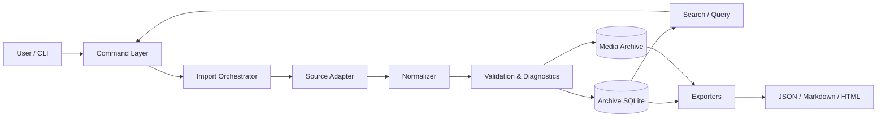
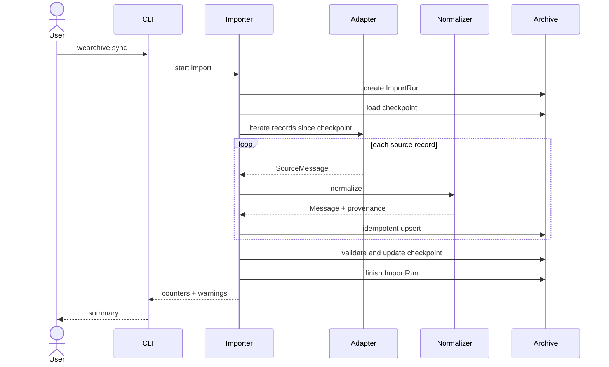
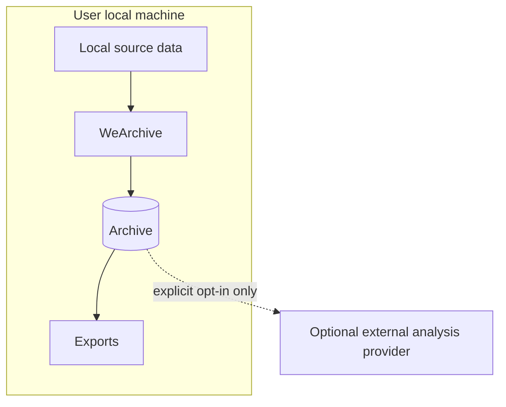

# WeArchive Technical Architecture

## 1. Architecture goals

The architecture is optimized for long-term maintainability rather than one-off extraction.

Key constraints:

- Upstream client formats may change frequently.
- The personal archive must remain stable across those changes.
- Source-specific behavior must not leak into export/search/business logic.
- Import runs must be observable, restartable and auditable.
- The initial product is CLI-first and local-first.

## 2. Logical architecture



## 3. Layering

### 3.1 Presentation / CLI

Responsibilities:

- Parse user intent.
- Display progress and warnings.
- Never contain source-format logic.

Planned module:

```text
src/wearchive/cli.py
```

### 3.2 Application / orchestration

Responsibilities:

- Coordinate source adapter, normalization, archive transaction and checkpoint update.
- Create import-run records.
- Enforce dry-run/read-only boundaries.
- Aggregate metrics and warnings.

Planned modules:

```text
src/wearchive/importer/
src/wearchive/services/
```

### 3.3 Source adapter layer

Responsibilities:

- Detect source profile/account.
- Enumerate conversations.
- Stream source messages and attachment metadata.
- Expose source/client version and freshness metadata.
- Translate source-specific failures into typed diagnostics.

Interface sketch:

```python
class SourceAdapter(Protocol):
    def describe_source(self) -> SourceDescriptor: ...
    def list_conversations(self) -> Iterable[SourceConversation]: ...
    def iter_messages(self, conversation_id: str, checkpoint: SourceCheckpoint | None = None) -> Iterable[SourceMessage]: ...
    def resolve_attachments(self, message: SourceMessage) -> Iterable[SourceAttachment]: ...
```

This layer is the only place where upstream client/version assumptions may exist.

### 3.4 Normalization layer

Responsibilities:

- Map source records into stable domain models.
- Preserve stable IDs and mutable display names separately.
- Normalize timestamps, message types and participant identities.
- Attach provenance.

Planned modules:

```text
src/wearchive/model/
src/wearchive/normalize/
```

### 3.5 Validation / diagnostics

Responsibilities:

- Detect missing source partitions.
- Detect unsupported message types.
- Detect timestamp/order anomalies.
- Detect duplicate logical records.
- Produce machine-readable warnings rather than silently dropping data.

### 3.6 Archive persistence

SQLite is the system of record for normalized archive metadata and message text.

Responsibilities:

- Migrations.
- Idempotent upserts.
- Checkpoints.
- Import-run audit trail.
- Search indexes.
- Integrity checks.

### 3.7 Media archive

Media is stored outside the SQLite database by content-addressed or stable archive paths.

Suggested layout:

```text
archive/
├─ archive.db
└─ media/
   ├─ image/
   ├─ voice/
   ├─ video/
   └─ file/
```

SQLite stores metadata, digest, size, provenance and archive path.

### 3.8 Query and export

Exporters operate only on normalized archive data, never directly on source files.

This guarantees that Markdown/HTML/JSON behavior is independent from upstream client changes.

## 4. Data flow



## 5. Repository structure target

```text
src/wearchive/
├─ cli.py
├─ config.py
├─ domain/
│  ├─ account.py
│  ├─ conversation.py
│  ├─ message.py
│  ├─ attachment.py
│  └─ provenance.py
├─ adapters/
│  ├─ base.py
│  └─ fixtures.py
├─ normalize/
├─ importer/
├─ archive/
│  ├─ db.py
│  ├─ migrations/
│  └─ repository.py
├─ search/
├─ export/
│  ├─ json_exporter.py
│  ├─ markdown_exporter.py
│  └─ html_exporter.py
└─ diagnostics/
```

## 6. Adapter contract

Every adapter must provide:

- `adapter_name`
- `adapter_version`
- `source_version`
- `source_profile_id`
- stable conversation IDs
- stable message/source IDs where available
- source timestamp
- source partition reference where applicable
- explicit completeness/freshness diagnostics

An adapter must not:

- Write normalized data directly into export files.
- Bypass the archive model for convenience.
- Hide unsupported source records.
- Store credentials or private data in repository-controlled paths.

## 7. Provenance model

A normalized message should be traceable through:

```text
Message
  -> source_profile_id
  -> source_conversation_id
  -> source_message_id
  -> source_partition
  -> import_run_id
  -> adapter_name/version
  -> source_version
```

Provenance is a first-class product requirement, not debugging metadata.

## 8. Incremental synchronization

Checkpoint design must be adapter-owned but archive-stored.

A checkpoint can contain opaque adapter state such as:

- last stable sequence identifier
- last imported timestamp
- per-partition cursors
- source snapshot fingerprints

The application layer treats checkpoint payloads as versioned opaque data.

Rules:

1. Checkpoints advance only after the corresponding archive transaction is durable.
2. Re-running from an older checkpoint must remain idempotent.
3. Adapter-version changes may invalidate checkpoints explicitly.

## 9. Error model

Errors are divided into three categories:

### Fatal

Import cannot safely continue.

Examples:

- Archive schema unavailable.
- Unsupported archive migration state.
- Source profile cannot be initialized.

### Partial

Import can continue but completeness is uncertain.

Examples:

- One source partition unavailable.
- One message type unsupported.
- Attachment unavailable locally.

### Informational

No correctness impact.

Examples:

- No new records.
- Optional metadata unavailable.

Every import run stores structured diagnostics.

## 10. Security architecture

Trust boundary:



Default behavior never requires external network access.

## 11. Architecture decisions

Major design changes must be recorded under:

```text
docs/adr/
```

ADR format:

- Context
- Decision
- Alternatives considered
- Consequences
- Status

Initial ADRs should cover:

- SQLite as archive system of record.
- Adapter/normalizer separation.
- CLI-first before GUI.
- Source read-only boundary.

## 12. Definition of architectural compliance

A code change is architecture-compliant when:

1. Its behavior maps to a documented requirement.
2. Source-specific logic stays in the adapter/compatibility boundary.
3. Export/search consume normalized archive models only.
4. New persistent fields include migration and provenance implications.
5. New failure cases are represented in diagnostics.
6. Documentation is updated when product behavior or architecture changes.
