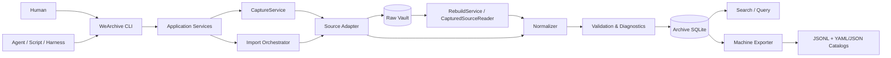
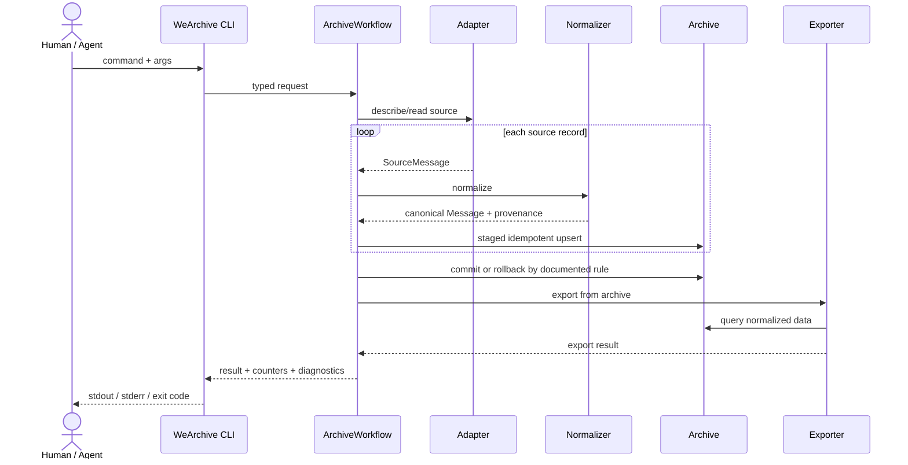

# WeArchive Technical Architecture

## 1. Architecture goals

WeArchive is optimized for long-term maintainability, machine-oriented analysis and deterministic automation rather than human-facing chat rendering.

Key constraints:

- upstream client formats may change frequently;
- the normalized archive must remain stable across those changes;
- source-specific behavior must not leak into query/export/CLI logic;
- import runs must be observable, restartable and auditable;
- the supported source is Windows WeChat 4.x and source access remains local-first/read-only;
- the primary product surface is a `gh`-style command CLI;
- Phase 1 does not preserve binary image/audio/video/file payloads;
- exported chat data is a plain-text dataset for scripts, LLMs and Harness workflows.

Normative message semantics are defined by [MESSAGE_SCHEMA.md](MESSAGE_SCHEMA.md). Normative export packaging is defined by [EXPORT_PRD.md](EXPORT_PRD.md). CLI product-surface rationale is recorded in [ADR 0006](adr/0006-cli-first-product-surface.md).

## 2. Logical architecture



The CLI is a thin transport/presentation boundary. It must not contain WeChat schema logic, normalization rules, archive publication semantics or export transaction semantics.

The **Raw Vault** is a preservation layer that captures a source-faithful snapshot *before*
normalization. It exists alongside the canonical SQLite archive but is independently versioned
and has its own manifest, reliability contract and storage root. See
[RAW_VAULT.md](RAW_VAULT.md) and [ADR 0008](adr/0008-raw-vault-storage-and-snapshot.md).

There is intentionally no Phase 1 media archive. Binary media/files are represented only by normalized textual events and locally available metadata such as filename or duration.

`Search / Query` is partially shipped: the M3a minimum retrieval slice — `ArchiveQueryService`,
`message list` and `context` — reads the canonical archive through its existing timeline index
(section 3.9). Keyword/full-text search remains M3b work and no FTS index exists yet.

## 3. Layering

Target dependency direction:

```text
WeArchive.Cli
    ↓
WeArchive.Infrastructure
    ↓
WeArchive.Core
```

`tests/WeArchive.Tests` may reference all three for contract and integration testing.

The historical `WeArchive.App` WPF project may exist temporarily during migration, but it is not a second supported product surface and must be removed when the CLI migration acceptance criteria are met.

### 3.1 Presentation — `src/WeArchive.Cli`

Target: console executable, `net10.0-windows`, assembly name `WeArchive`.

Responsibilities:

- parse explicit `gh`-style commands/options;
- translate command arguments into application-service calls;
- render concise human-readable output;
- render one stable JSON document on stdout for `--json`;
- send progress and human diagnostics to stderr;
- enforce `--quiet` and `--no-input` behavior;
- map documented outcomes to process exit codes;
- never touch WeChat source files directly and never implement source-format/business logic.

Initial command family:

```text
wearchive doctor
wearchive account list
wearchive conversation list
wearchive conversation show <id-or-alias>
wearchive sync --conversation <id-or-alias>
wearchive export --conversation <id-or-alias>
wearchive capture [--account <id>]
```

Search/statistics/query commands are added only when their underlying requirements are implemented.
The query commands (`message list`, `context`) are implemented by Issue #27 and are thin adapters
over `ArchiveQueryService` (section 3.9); keyword search is not implemented.
The Collection scope commands (`collection list`, `collection show <name>`, `sync --collection <name>`)
are implemented by Issue #26; Collection query/search/export selection remains M3/M4 follow-up work
(see section 3.8).

### 3.1.1 CLI process contract

Machine-readable mode is a product API:

```text
stdout  final result; with --json exactly one JSON document
stderr  progress, warnings and human diagnostics
0       operation completed under documented semantics
1       runtime/operation failure, including Fatal diagnostics
2       usage/configuration validation failure
130     cancellation/user interrupt
```

`--no-input` must never prompt. Missing information becomes a deterministic failure instead.

With `--json`, stdout carries exactly one JSON document on every path, including paths that
do not reach a command:

- a successful command result rendered by the command itself;
- the command surface itself (`--help --json`, and a bare `wearchive --json`) rendered as a
  help document (`usage`, `commands`, `options`);
- a failure (usage error, runtime failure, cancellation) rendered as an error document
  (`error.code`, `error.message`), where `error.code` mirrors the exit-code family below.

Human diagnostics — including help text printed because a command was missing or unknown —
stay on stderr, and `--quiet` never suppresses a failure. The process exit code remains the
authoritative outcome class.

A **multi-scope** operation (currently `sync --collection <name>`) is the one documented refinement:
because one run legitimately publishes some conversations and fails others, stdout carries the
structured per-scope result document on every path — including a partial failure — so a machine
caller can still see which members succeeded. That document is the failure report (`succeeded:
false` with a per-item `error`), the exit code stays the authoritative outcome class (non-zero when
any requested conversation failed), and `--json` still emits exactly one JSON document. A
single-scope failure keeps the error-document shape above.

CLI JSON DTOs are presentation contracts. They may wrap Core domain results but must not expose unstable implementation internals such as raw WeChat table names or parser-specific types.

### 3.2 Application / orchestration — `src/WeArchive.Core/Services`

Responsibilities:

- coordinate source adapter, normalization, archive transaction and checkpoint update;
- stage one conversation's records in a single archive transaction and publish only under the documented import transaction rules;
- create import-run records;
- enforce read-only source boundaries;
- aggregate metrics and diagnostics;
- invoke machine-oriented exports from normalized archive data only.

Key services:

```text
SourceCatalogService   # describe source, list accounts/conversations, describe conversation
ImportService          # adapter -> normalizer -> archive, with diagnostics
ArchiveWorkflow        # sync/export coordination and archive statistics
ArchiveQueryService    # bounded canonical retrieval, context windows and freshness (section 3.9)
```

#### 3.2.1 Import publication

One import stages exactly one conversation — its conversation row and every message batch — inside one archive transaction (`IArchiveStore.BeginConversationImportAsync`).

A **Fatal source-coverage failure must roll back the entire conversation transaction**. No record from that failed run may become usable archive state. The failed run may retain audit counters such as `records_scanned`, but must not claim committed inserts/updates that are absent from the archive.

Cancellation is a separate failure class, not implicitly a coverage failure. Its publication semantics must match the explicit reliability level in `DEVELOPMENT.md`; reviewers must not infer a stronger transaction/recovery guarantee from words such as “safe”.

Account and participant rows are account-level identity metadata and are not themselves evidence that one conversation was read completely.

### 3.3 Source adapter layer — `src/WeArchive.Core/Abstractions`

Responsibilities:

- detect source profile/account;
- enumerate conversations;
- stream source messages/events;
- expose source/client version and freshness metadata;
- expose locally available semantic fields needed by the canonical schema;
- translate source-specific failures into typed diagnostics;
- cheaply describe one conversation without loading full message bodies.

The contract (`ISourceAdapter`, C#):

```csharp
public interface ISourceAdapter
{
    string AdapterName { get; }
    string AdapterVersion { get; }

    Task<SourceDescriptor> DescribeSourceAsync(CancellationToken cancellationToken);
    Task<IReadOnlyList<SourceAccount>> ListAccountsAsync(CancellationToken cancellationToken);
    Task<IReadOnlyList<SourceConversation>> ListConversationsAsync(
        string sourceProfileId,
        CancellationToken cancellationToken);
    IAsyncEnumerable<SourceMessage> ReadMessagesAsync(
        string sourceProfileId,
        string sourceConversationId,
        CancellationToken cancellationToken);
    Task<IReadOnlyList<SourceParticipant>> ListParticipantsAsync(
        string sourceProfileId,
        CancellationToken cancellationToken);
    Task<SourceConversationDetail> DescribeConversationAsync(
        string sourceProfileId,
        string sourceConversationId,
        CancellationToken cancellationToken);
}
```

A record the parser cannot interpret is emitted as `Unknown`; it is never silently dropped.

Implementations:

- `WeArchive.Infrastructure/Fixtures/FixtureSourceAdapter` — synthetic fixture source;
- `WeArchive.Infrastructure/WeChat/WeChatWindowsSourceAdapter` — real WeChat 4.x adapter.

#### 3.3.1 WeChat compatibility boundary

```text
src/WeArchive.Infrastructure/WeChat/
├─ Compatibility/     version-specific schema/type assumptions
├─ Parsers/           wire payloads -> source-neutral content
├─ Crypto/            SQLCipher page cryptography
├─ KeyAcquisition/    read-only process-memory key acquisition
└─ adapter/client/data-locator/cache support
```

Rules:

1. Every WeChat version-specific table/column/type assumption stays in compatibility code.
2. `Core` never learns WeChat table names or numeric message type codes.
3. Key acquisition and page cryptography stay within the WeChat infrastructure boundary.
4. Decrypted material exists only transiently under `%LOCALAPPDATA%\WeArchive\scratch` and is deleted when the adapter is disposed.

### 3.4 Normalization layer — `src/WeArchive.Core/Normalization`

Responsibilities:

- map source records into stable domain models;
- preserve stable IDs and mutable names separately;
- normalize timestamps and participant identities;
- map upstream types into canonical semantic message types;
- build `text`, `payload`, `reply_to` and `source` according to `MESSAGE_SCHEMA.md`;
- preserve unknown records instead of silently dropping them.

### 3.5 Validation / diagnostics

Diagnostics are structured product data, not only log text.

Severities are `Fatal`, `Partial` and `Info`. Diagnostics carry stable codes and engineering context but never chat content or database keys.

Examples include:

- `unknown_message_type`;
- `unresolved_reply_target`;
- `link_wrapper_url_only`;
- `key_acquisition_failed`;
- `partition_missing` / `partition_unreadable`;
- `wal_frames_rejected`.

### 3.6 Archive persistence — `src/WeArchive.Infrastructure/Archive`

SQLite is the **system of record** for normalized archive data.

Responsibilities:

- migrations;
- idempotent upserts;
- single-conversation transaction publication;
- checkpoints;
- import-run audit trail;
- canonical message semantics;
- identity/conversation metadata;
- future search indexes;
- integrity checks.

Export files are derived state and may be regenerated from SQLite.

### 3.6.1 Raw Vault persistence — `src/WeArchive.Infrastructure/RawVault`

The Raw Vault is a preservation layer that captures a source-faithful snapshot *before*
normalization. It is separate from the canonical SQLite archive: it has its own format version,
manifest, reliability contract (R1) and storage root (`%LOCALAPPDATA%\WeArchive\rawvault`).

Responsibilities:

- stage and publish immutable generations (publish-last);
- record versioned manifests with source/capture provenance, artifact roles and SHA-256 checksums;
- discover and validate published generations (checksum re-verification on open);
- never inspect artifact internals — artifacts are opaque content objects.

Version-2 manifests carry generic partition coverage and the capture checkpoint. `CaptureService`
checks the previous published generation and its checkpoint before invoking an adapter's optional
`IIncrementalSourceCaptureAdapter` path, and only accepts a `complete` generation whose coverage
and checkpoint agree. The WeChat adapter alone computes source-specific database/WAL fingerprints
and decides which partitions may reuse verified artifacts; the store copies reused evidence into
the new immutable generation so every generation stays self-contained. A missing, mismatched or
unsafe cursor (including a version-1 generation, a changed adapter version or a `partial`
predecessor) widens the run to a full consistent snapshot and reports it diagnostically rather
than claiming incremental coverage. The checkpoint is published inside the manifest, so it
advances only with a successful publish-last publication and stays independent of canonical
ingest progress. Incremental capture keeps the R1 contract: no journal, commit marker or
recovery state machine is added.

The WeChat adapter reaches the live source only through an injectable environment seam — account
and database discovery, the client-running probe, the detected client version and the
materialization step. Production wires the real locator, client probe and SQLCipher cache; tests
supply a fixture source, which is what puts the shipped fingerprint/prior-map/reuse/recheck
decision under CI without a live client or a database key (NFR-06).

`RebuildService` and `RawVaultIngestService` are the workflows that open Raw Vault contents for
semantic ingestion: rebuild consumes the selected snapshot, while incremental ingestion commits
verified generations conversation by conversation. They select a captured-source reader in the
WeChat Infrastructure boundary using manifest
family/version and artifact format metadata. That reader reuses the existing WeChat 4.x parser
and emits source-neutral records to the normalizer/import pipeline; it does not invoke live
discovery, message reads or key acquisition. Rebuild initializes a fresh archive through normal
migrations, validates it, and replaces the selected archive only after validation succeeds. No
persistent recovery journal is added.

The store treats artifacts as opaque. WeChat schema details (table names, column names, message
type codes) live *inside* the artifacts, not in Core-visible manifest fields. Source acquisition,
key recovery and SQLCipher decryption stay inside the WeChat infrastructure boundary
(`src/WeArchive.Infrastructure/WeChat`).

The upstream WeChat database key is never persisted: it exists only in memory for the duration
of a capture and is deleted when the scratch cache is disposed. Captured artifacts are decrypted
content, readable without the key.

See [RAW_VAULT.md](RAW_VAULT.md) and [ADR 0008](adr/0008-raw-vault-storage-and-snapshot.md).

### 3.7 Query and export — `src/WeArchive.Infrastructure/Export`

Search and exporters consume normalized archive models only, never upstream source files directly.

Phase 1 export shape:

```text
manifest.json
identities.yaml
conversations.yaml
collections.yaml
chats/direct/<stable-id>/<year>/<year>-<MM>.jsonl
chats/groups/<stable-id>/<year>/<year>-<MM>.jsonl
```

Export reliability is deliberately bounded: caught in-process cancellation/I/O failures attempt restoration of previous output where documented, but process crash, OS/filesystem crash and power loss are **not** guaranteed recovery classes in Phase 1. See `DEVELOPMENT.md` Reliability Levels and `EXPORT_PRD.md` section 3.2.

### 3.8 Collection scope — `src/WeArchive.Core/Collections`, `src/WeArchive.Core/Services`

`Collection` is the one reusable scope abstraction above capture/ingest orchestration
(`docs/PRD.md` FR-23, `docs/HARNESS.md` section 8). It is deliberately not a `sync-group`,
`watch-list` or `harness-dataset`.

```text
Collection -> stable conversation IDs -> capture live evidence (CaptureService)
                                      -> per-conversation Raw Vault ingest
```

Responsibilities:

- `CollectionCatalogService` (Core) reads the one authoritative application-level Collection
  configuration through `ICollectionCatalogSource`, validates the documented schema/version and
  resolves a name to stable conversation membership. It performs no file I/O itself and depends on
  no YAML library; `WeArchive.Infrastructure/Collections/YamlCollectionCatalogSource` owns reading
  and deserializing the file.
- `CollectionSyncService` (Core) orchestrates one named Collection: resolve membership, capture
  required live-source evidence once through the shared `CaptureService`, then ingest each
  conversation through `IConversationIngestService`. It introduces no second source parser and no
  JSONL scanning.
- The Raw Vault ingest implementation (`RawVaultIngestService`, Infrastructure) selects a
  conversation by stable conversation ID or upstream source conversation ID, so the Collection's
  membership keys address the same conversations the discovery surface reports.

Collection execution is **multi-scope, not one transaction**: each conversation's canonical writes
and ingest checkpoint commit in that conversation's own SQLite transaction. A conversation failure
therefore never rolls back another conversation's committed progress, and a run reports structured
per-conversation success/no-change/failed/unresolved state instead of a single pass/fail. Reliability
levels are unchanged: capture is still R1 and one conversation's import is still R2.

Authoritative Collection configuration ownership (an application-level user-maintained file rather
than the derived export-package catalog or the rebuildable canonical database) is recorded in
[ADR 0009](adr/0009-collection-configuration-ownership.md).

### 3.9 Query access — `src/WeArchive.Core/Services/ArchiveQueryService.cs`

`ArchiveQueryService` is the single source-independent application boundary for structured
retrieval ([`PRD.md`](PRD.md) FR-16/FR-17, [`HARNESS.md`](HARNESS.md) sections 2–5, ADR 0008).
CLI `--json` and a future MCP transport are thin adapters over it; `src/WeArchive.Cli/Commands`
owns option parsing and rendering only, never query semantics.

Responsibilities:

- list bounded canonical messages by stable conversation, date range, participant and canonical
  type, with opaque keyset cursor pagination;
- return a bounded context window around a stable message id;
- report capture, ingest and canonical freshness from independent sources.

It reads **only** the canonical SQLite archive for retrieval, through `IArchiveStore` and the
existing timeline index. It never opens live WeChat, never acquires or holds a key, never reads Raw
Vault source-format artifacts and never uses exported JSONL as a runtime store. The preservation
store is reached for one purpose only — capture freshness — through the Core `IRawVaultStore`
contract, so no Raw Vault physical layout reaches a caller (`PRD.md` NFR-13).

Query is read-only (**R0**): it adds no journal, checkpoint, transaction protocol or recovery state,
and no failure path mutates canonical data, Raw Vault evidence or a checkpoint. Pagination cursors
are opaque API tokens, not persistent archive records, so no migration is involved
([`DATA_MODEL.md`](DATA_MODEL.md) section 23).

Keyword/full-text search remains M3b target work; `ArchiveQueryService` does not implement it and
no FTS index exists.

## 4. Data flow



The exporter reads the archive only; it never reopens the source.

## 5. Target repository structure

```text
WeArchive.sln
src/
├─ WeArchive.Core/                 net10.0; domain/contracts/services
├─ WeArchive.Infrastructure/       net10.0-windows; WeChat/SQLite/export/settings
└─ WeArchive.Cli/                  net10.0-windows; command parsing/output/composition root
tests/
└─ WeArchive.Tests/                net10.0-windows; xUnit v2 on VSTest
```

During migration, `src/WeArchive.App` may still exist. It is transitional and should not receive new product behavior except work strictly required to keep the branch buildable until removal.

## 6. Adapter contract rules

Every adapter must provide stable source/account/conversation/message identifiers, timestamps, partition references where applicable, source version metadata, source ordering evidence, explicit completeness/freshness diagnostics and locally obtainable semantic data.

An adapter must be read-only toward the source and must not:

- write exports directly;
- bypass the archive for convenience;
- hide unsupported records;
- fabricate identities, URLs, amounts or message content;
- require binary-media preservation for Phase 1 correctness.

### 6.1 Upstream message identity

Preferred strategy:

```text
server id present -> s:<server_id>
otherwise         -> l:<partition>:<local_id>
```

If an adapter cannot provide a native/documented composite identity, that is a source-coverage failure. It must not skip the record or fabricate an identity.

## 7. Canonical message boundary

```text
Message
├─ common envelope
├─ text
├─ payload
├─ reply_to
└─ source
```

Downstream query/export/CLI logic must not depend on upstream numeric message types or raw XML layouts.

## 8. Identity model

Stable identity and human naming are separate. Conversation physical paths use stable IDs, never mutable names. `display_name_override` is the documented user-maintained identity hook.

## 9. Link/app-share normalization

Preserve locally obtainable semantic metadata including title, description, source application, original URL, wrapper/fallback URL, app ID and page path. Remote webpage crawling is not required for canonical Phase 1 export.

## 10. Incremental synchronization

Checkpoint design is adapter-owned but archive-stored.

Rules:

1. checkpoints advance only after the corresponding archive transaction is committed under the documented reliability contract;
2. replay from an older checkpoint remains idempotent;
3. adapter-version changes may explicitly invalidate checkpoints.

Raw Vault ingestion consumes verified generations in order and stores a versioned content cursor per conversation in the same SQLite transaction as that conversation's canonical publication. When a newer generation has unchanged conversation evidence, the content cursor remains unchanged; a scoped scan instead stores a separate `conversation_coverage` cursor transactionally without a second message import pass or a new import run. Account-wide scans store a separate account-scope cursor only after a full generation has been examined; scoped conversation imports do not advance that scan cursor. This separates changed content, scoped coverage and complete account discovery, allowing repeats to skip verified generations while later account-wide runs still discover conversations not yet imported. Captured participant metadata is refreshed from each opened generation. The legacy migration-1 `source_checkpoints` remains readable and is not reinterpreted.

## 11. Error model

### Fatal

The operation cannot publish a result under the relevant product contract.

Examples: archive schema unavailable, unsupported migration state, source profile initialization failure, key acquisition failure, required source coverage unavailable, source message identity unavailable.

For **Fatal source-coverage failure during import**, the whole conversation transaction is rolled back.

### Partial

The operation may continue and publish only when the corresponding PRD explicitly permits a valid partial result. Partial is never shorthand for “we lost unknown data but continued anyway”.

Examples: unknown message semantics represented as `unknown`, unresolved reply target with preserved snapshot, wrapper-only link metadata, optional filename/duration unavailable.

### Info

No correctness impact, for example no new records or optional metadata unavailable.

## 12. Security architecture

Core archive/export workflows do not require external network access.

Rules:

1. source databases are read-only;
2. WeChat keys are recovered read-only from the running client and cryptographically verified;
3. no code injection/hooking/debugger attachment is required;
4. decrypted scratch data is transient and deleted on adapter disposal;
5. keys are never persisted, logged or exported;
6. chat content is never logged.

See [ADR 0005](adr/0005-wechat-local-key-acquisition.md).

## 13. Architecture decisions

Major design changes require ADR consideration, including changing the canonical message envelope, stable identity/path strategy, archive system of record, local source access/decryption, binary-media persistence, external crawling, derived LLM data layers, or the primary product surface.

## 14. Definition of architectural compliance

A code change is architecture-compliant when:

1. behavior maps to a documented requirement and issue;
2. source-specific logic stays behind adapter/compatibility boundaries;
3. normalizer output follows `MESSAGE_SCHEMA.md`;
4. query/export consume normalized archive models only;
5. CLI remains a thin application-service adapter;
6. machine-readable stdout is not polluted by progress or prompts;
7. mutable names never define stable identity/paths;
8. new failure/unknown cases become structured diagnostics;
9. persistent changes include migration/provenance implications;
10. implementation does not silently strengthen reliability semantics beyond the PRD/Issue/milestone;
11. docs change with behavior or architecture.
