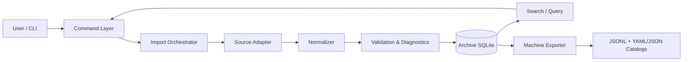
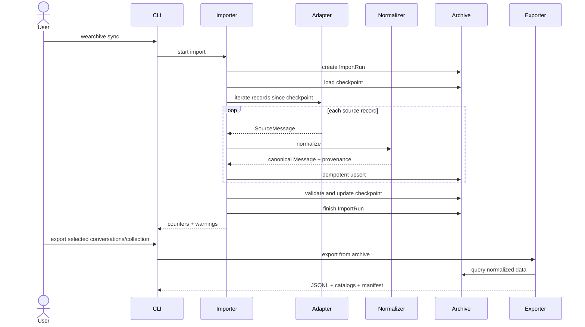
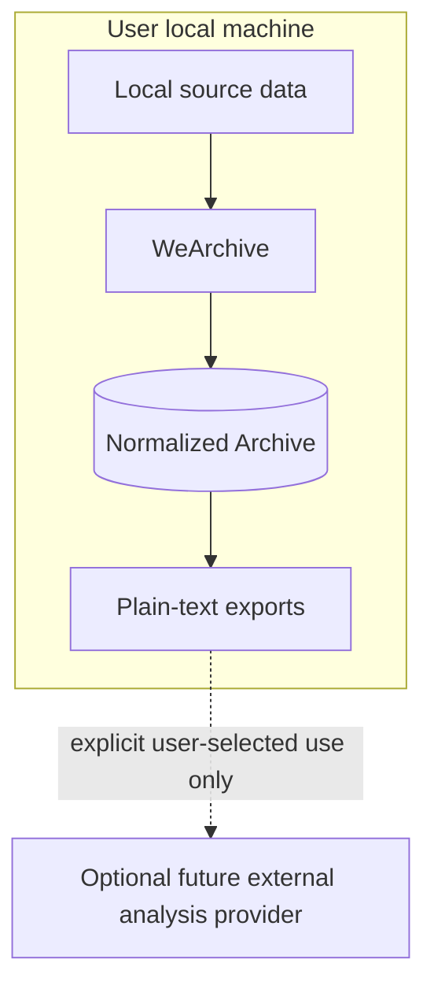

# WeArchive Technical Architecture

## 1. Architecture goals

WeArchive is optimized for long-term maintainability and machine-oriented analysis rather than human-facing chat rendering.

Key constraints:

- upstream client formats may change frequently;
- the normalized archive must remain stable across those changes;
- source-specific behavior must not leak into search/export/business logic;
- import runs must be observable, restartable and auditable;
- Phase 1 is CLI-first, local-first and read-only toward the source;
- Phase 1 does not preserve binary image/audio/video/file payloads;
- exported chat data is a plain-text dataset for scripts, LLMs and Harness workflows.

Normative message semantics are defined in [MESSAGE_SCHEMA.md](MESSAGE_SCHEMA.md). Normative export packaging is defined in [EXPORT_PRD.md](EXPORT_PRD.md).

## 2. Logical architecture



There is intentionally no Phase 1 media archive. Binary media/files are represented only by normalized textual events and locally available metadata such as filename or duration.

## 3. Layering

### 3.1 Presentation / CLI

Responsibilities:

- parse user intent;
- select source/account/conversations/time ranges;
- display progress and diagnostics;
- expose export-by-conversation/alias/collection workflows;
- never contain source-format logic.

### 3.2 Application / orchestration

Responsibilities:

- coordinate source adapter, normalization, archive transaction and checkpoint update;
- create import-run records;
- enforce read-only source boundaries;
- aggregate metrics and warnings;
- invoke machine-oriented exports from normalized archive data only.

Planned modules:

```text
src/wearchive/importer/
src/wearchive/services/
```

### 3.3 Source adapter layer

Responsibilities:

- detect source profile/account;
- enumerate conversations;
- stream source messages/events;
- expose source/client version and freshness metadata;
- expose locally available semantic fields needed by the canonical schema;
- translate source-specific failures into typed diagnostics.

Interface sketch:

```python
class SourceAdapter(Protocol):
    def describe_source(self) -> SourceDescriptor: ...
    def list_conversations(self) -> Iterable[SourceConversation]: ...
    def iter_messages(
        self,
        conversation_id: str,
        checkpoint: SourceCheckpoint | None = None,
    ) -> Iterable[SourceMessage]: ...
```

This layer is the only place where upstream client/version assumptions may exist.

### 3.4 Normalization layer

Responsibilities:

- map source records into stable domain models;
- preserve stable IDs and mutable names separately;
- normalize timestamps and participant identities;
- map upstream types into canonical semantic message types;
- build `text`, `payload`, `reply_to` and `source` according to `MESSAGE_SCHEMA.md`;
- preserve unknown records instead of silently dropping them.

Planned modules:

```text
src/wearchive/domain/
src/wearchive/normalize/
```

### 3.5 Validation / diagnostics

Responsibilities:

- detect missing source partitions;
- detect unsupported or unknown message types;
- detect timestamp/order anomalies;
- detect duplicate logical records;
- detect unresolved reply targets;
- report partial link/app-share parsing;
- produce machine-readable warnings rather than silently losing data.

### 3.6 Archive persistence

SQLite is the system of record for normalized archive data.

Responsibilities:

- migrations;
- idempotent upserts;
- checkpoints;
- import-run audit trail;
- canonical message semantics;
- identity/conversation metadata;
- search indexes;
- integrity checks.

Phase 1 archive storage is text/metadata oriented. Binary media copies are outside scope.

### 3.7 Query and export

Search and exporters consume normalized archive models only, never upstream source files directly.

The Phase 1 exporter produces:

```text
manifest.json
identities.yaml
conversations.yaml
collections.yaml
chats/direct/<stable-id>/<year>/<month>.jsonl
chats/groups/<stable-id>/<year>/<month>.jsonl
```

This guarantees that downstream LLM/Harness workflows remain stable when the upstream client format changes.

## 4. Data flow



## 5. Repository structure target

```text
src/wearchive/
├─ cli.py
├─ config.py
├─ domain/
│  ├─ account.py
│  ├─ conversation.py
│  ├─ participant.py
│  ├─ message.py
│  └─ provenance.py
├─ adapters/
│  ├─ base.py
│  └─ fixtures.py
├─ normalize/
├─ importer/
├─ archive/
│  ├─ db.py
│  ├─ migrations/
│  └─ repository.py
├─ search/
├─ export/
│  ├─ dataset_exporter.py
│  ├─ catalogs.py
│  └─ manifest.py
└─ diagnostics/
```

## 6. Adapter contract

Every adapter must provide:

- `adapter_name`;
- `adapter_version`;
- `source_version`;
- `source_profile_id`;
- stable conversation IDs;
- stable participant IDs where available;
- stable message/source IDs where available;
- source timestamps;
- source partition references where applicable;
- explicit completeness/freshness diagnostics;
- locally obtainable semantic data for supported message types.

An adapter must not:

- write exports directly;
- bypass the archive model for convenience;
- hide unsupported source records;
- fabricate identities, URLs, amounts or message content;
- require binary-media preservation for Phase 1 correctness.

## 7. Canonical message boundary

The normalizer emits the semantic contract defined by `MESSAGE_SCHEMA.md`:

```text
Message
├─ common envelope
│  ├─ id
│  ├─ conversation_id
│  ├─ sender_id
│  ├─ time
│  └─ type
├─ text
├─ payload
├─ reply_to
└─ source
```

Downstream search/export logic must not depend on upstream numeric message types or raw XML layouts.

## 8. Identity model

Stable identity and human naming are separate.

```text
stable user id (u_...)
    ├─ source user id
    ├─ latest remark
    ├─ nickname
    └─ user-maintained display_name
```

Default exported `display_name` uses the latest available remark. If no remark exists, it remains blank; nickname is metadata only.

Conversation physical paths use stable IDs, never mutable names.

## 9. Link/app-share normalization

The normalizer should preserve locally obtainable semantic metadata including:

- title;
- description;
- source application;
- original URL;
- wrapper/fallback URL;
- app ID;
- page path.

The architecture does not require remote webpage crawling for canonical Phase 1 export.

## 10. Incremental synchronization

Checkpoint design is adapter-owned but archive-stored.

A checkpoint may contain opaque versioned state such as:

- last stable sequence identifier;
- last imported timestamp;
- per-partition cursors;
- source snapshot fingerprints.

Rules:

1. checkpoints advance only after the corresponding archive transaction is durable;
2. replay from an older checkpoint remains idempotent;
3. adapter-version changes may explicitly invalidate checkpoints.

## 11. Error model

### Fatal

Import/export cannot safely continue.

Examples:

- archive schema unavailable;
- unsupported migration state;
- source profile cannot be initialized.

### Partial

Operation can continue but completeness is uncertain.

Examples:

- one source partition unavailable;
- one message type is unknown;
- a reply target cannot be resolved;
- app-share metadata lacks a confirmed original URL.

### Informational

No correctness impact.

Examples:

- no new records;
- optional metadata unavailable;
- selected collection contains no records for a requested month.

All import runs retain structured diagnostics.

## 12. Security architecture



Core archive/export workflows do not require external network access.

## 13. Architecture decisions

Major design changes must be recorded under `docs/adr/`.

Changes that require ADR consideration include:

- changing the canonical message envelope;
- changing stable identity/path strategy;
- adding binary-media persistence;
- adding remote content crawling to canonical export;
- adding a derived LLM/chunk layer;
- changing the archive system of record.

## 14. Definition of architectural compliance

A code change is architecture-compliant when:

1. its behavior maps to a documented requirement;
2. source-specific logic stays inside adapter/compatibility boundaries;
3. normalizer output follows `MESSAGE_SCHEMA.md`;
4. search/export consume normalized archive models only;
5. mutable names never define stable identity or physical paths;
6. new failure/unknown cases appear in diagnostics rather than disappearing;
7. new persistent fields include migration/provenance implications;
8. documentation is updated whenever behavior or architecture changes.
