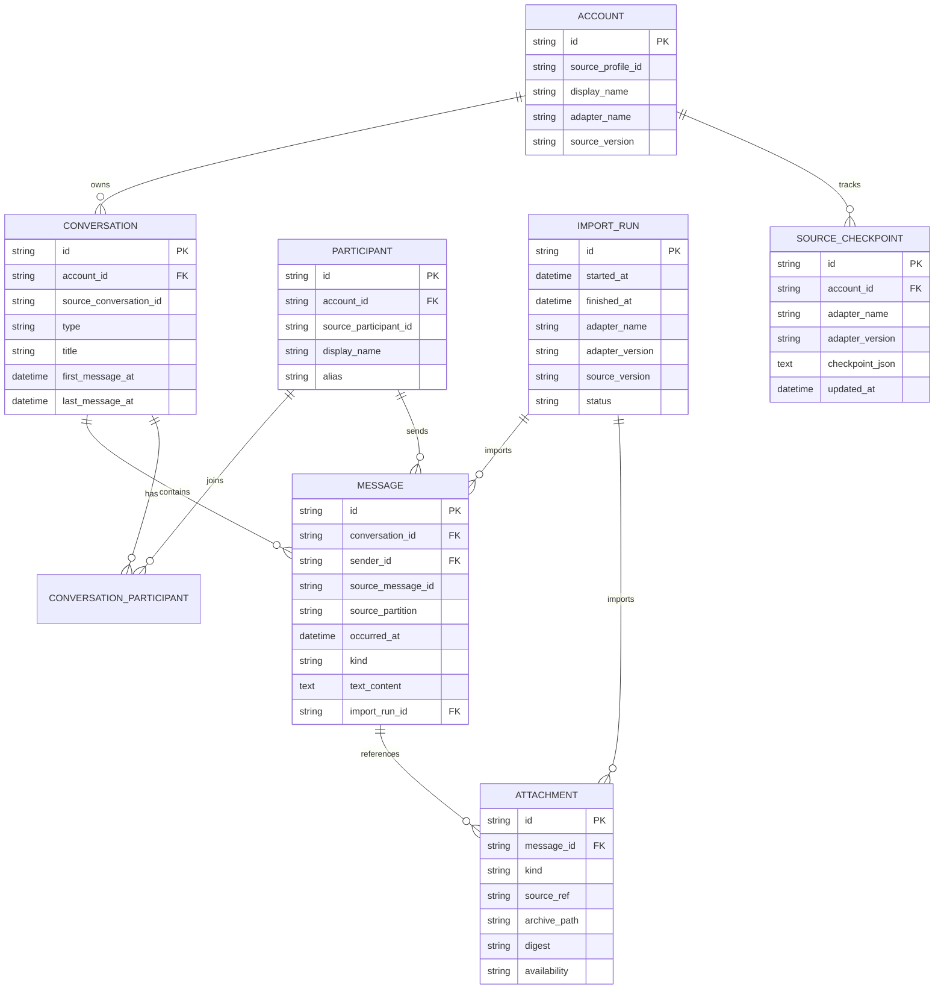

# WeArchive Data Model

## 1. Purpose

The normalized data model decouples the long-lived personal archive from any single upstream client format.

Source adapters may change often. The archive schema should change only when product semantics change.

## 2. Core principles

1. Stable IDs and display names are separate concepts.
2. Source provenance is first-class.
3. Import runs are auditable.
4. Re-import must be idempotent.
5. Attachments are modeled independently from messages.
6. Source-specific fields belong in provenance/metadata, not in core domain columns unless they have product meaning.

## 3. Entity relationship overview



## 4. Account

Represents one logical source profile imported into an archive.

Required concepts:

- Internal archive `id`.
- Stable `source_profile_id` from adapter.
- Adapter identity.
- Source/client version metadata.
- Optional display label.

An Account is not an authentication credential record.

## 5. Conversation

Represents a private chat, group chat or other supported logical conversation.

Fields:

- stable archive ID
- account ID
- stable source conversation ID
- type: `private`, `group`, `official`, `system`, `unknown`
- current title/display name
- optional first/last known timestamps
- archive timestamps

Conversation titles are mutable and must never be used as identity keys.

## 6. Participant

Represents a stable logical sender/contact identity when available.

Recommended fields:

- archive ID
- account ID
- source participant ID
- current display name
- alias/remark
- optional avatar reference

Display names can change and can collide.

## 7. ConversationParticipant

Many-to-many relation between conversations and participants.

Possible future fields:

- role
- group nickname
- join/leave timing where available

## 8. Message

Canonical archived message.

Required semantics:

- archive message ID
- conversation
- sender if known
- source message ID if available
- source partition/shard identifier if applicable
- source ordering key if applicable
- occurred-at timestamp
- normalized kind
- normalized text content where applicable
- raw/structured payload reference where retained
- import run

### Message kinds

Initial normalized set:

- `text`
- `image`
- `voice`
- `video`
- `file`
- `link`
- `location`
- `contact`
- `quote`
- `system`
- `other`

Unknown source types must map to `other` with diagnostics; they must not be silently discarded.

## 9. Attachment

Represents an attachment or media object associated with a message.

Availability states:

- `metadata_only`
- `available_local`
- `archived`
- `missing`
- `unsupported`

Recommended fields:

- attachment ID
- message ID
- kind
- source reference
- original filename where available
- MIME/type hint
- byte size
- digest
- archive path
- availability
- import run/provenance

## 10. ImportRun

Every sync/import invocation creates one ImportRun.

Required fields:

- run ID
- start/end time
- adapter name/version
- source version
- status
- records scanned
- records inserted
- records updated
- records skipped
- warnings count
- errors count
- structured diagnostic summary

This entity is required for operational trust.

## 11. SourceCheckpoint

Stores adapter-owned incremental state.

Rules:

- payload is versioned
- payload is opaque to the generic importer
- checkpoint update occurs only after durable archive commit
- adapter version change may invalidate prior checkpoint

## 12. SourceArtifact / provenance

Where needed, archive the relationship between normalized records and source artifacts/partitions.

Minimum provenance fields for Message:

```text
source_profile_id
source_conversation_id
source_message_id
source_partition
source_order_key
adapter_name
adapter_version
source_version
import_run_id
```

## 13. Identity strategy

Archive IDs should be deterministic where practical.

Recommended approach:

```text
namespace + stable source identifiers -> deterministic UUID/hash
```

Example logical inputs:

- Account: adapter + source_profile_id
- Conversation: account + source_conversation_id
- Participant: account + source_participant_id
- Message: account + source conversation + stable source message ID

When no stable source message ID exists, adapters must define a documented composite identity strategy and collision behavior.

## 14. Deduplication

Deduplication must prefer stable source identity over content heuristics.

Fallback content-based deduplication, if ever used, must be explicit and conservative because repeated identical messages are valid data.

## 15. Schema evolution

- Use numbered database migrations.
- Never mutate production archives without migration records.
- Backward-incompatible archive changes require a documented migration path.
- Export formats may evolve independently but must identify their schema/version.

## 16. Search indexing

Full-text search is a derived index, not the canonical store.

The FTS index should be rebuildable from normalized Message rows and selected structured fields.

## 17. Raw source retention

Raw source records are optional and should not be required for the normal archive experience.

If retained for debugging/reproducibility:

- store separately from normalized columns
- mark format/version
- allow disabling retention
- avoid placing large opaque blobs in the core Message table
