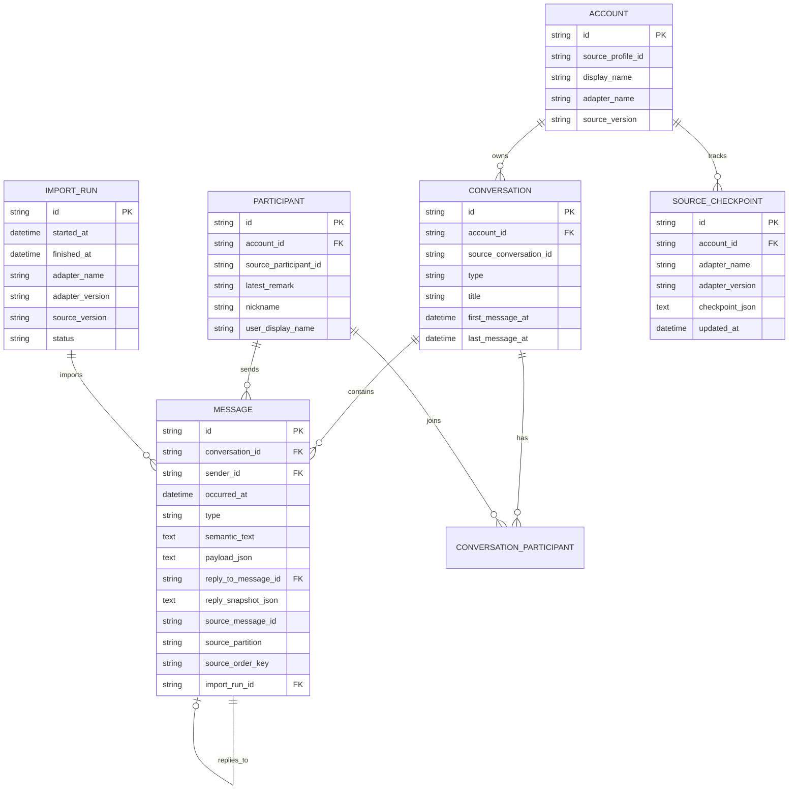

# WeArchive Data Model

## 1. Purpose

The normalized data model decouples the long-lived personal archive from any single upstream client format.

Source adapters may change often. The archive schema should change only when product semantics change.

The canonical message semantics are defined by [MESSAGE_SCHEMA.md](MESSAGE_SCHEMA.md). Phase 1 export behavior is defined by [EXPORT_PRD.md](EXPORT_PRD.md).

## 2. Core principles

1. Stable IDs and display names are separate concepts.
2. Source provenance is first-class.
3. Import runs are auditable.
4. Re-import must be idempotent.
5. Message semantics are source-independent.
6. Binary media is not required for the Phase 1 export product.
7. Source-specific fields belong in provenance/metadata, not in core domain columns unless they have product meaning.
8. Unknown records are retained rather than silently discarded.

## 3. Entity relationship overview



## 4. Account

Represents one logical source profile imported into an archive.

Required concepts:

- internal archive `id`;
- stable `source_profile_id` from adapter;
- adapter identity;
- source/client version metadata;
- optional display label.

An Account is not an authentication credential record.

## 5. Conversation

Represents a private chat, group chat or other supported logical conversation.

Fields:

- stable archive ID;
- account ID;
- stable source conversation ID;
- type: `direct`, `group`, `official`, `system`, `unknown`;
- current title/display name;
- optional user-maintained alias in export configuration;
- optional first/last known timestamps.

Conversation titles are mutable and must never be used as identity keys or physical export paths.

## 6. Participant

Represents a stable logical sender/contact identity when available.

Recommended fields:

- archive ID;
- account ID;
- stable source participant ID;
- latest available remark;
- latest nickname;
- optional user-maintained display name.

Phase 1 export identity rules:

```text
latest remark exists -> default display_name = latest remark
no latest remark      -> default display_name = ""
```

Nickname is retained as metadata but does not automatically fill a missing remark.

Display names can change and collide. Stable participant IDs must remain the canonical identity.

## 7. ConversationParticipant

Many-to-many relation between conversations and participants.

Useful fields may include:

- group nickname;
- role;
- join/leave timing where available.

Group-specific names never replace the canonical participant ID.

## 8. Message

`Message` is the canonical archived semantic event.

Required semantics:

- archive message ID;
- conversation ID;
- sender ID when resolvable;
- canonical timestamp;
- normalized semantic `type`;
- LLM/search-oriented semantic `text`;
- optional type-specific structured `payload`;
- optional reply/reference relationship;
- source provenance;
- import run.

### 8.1 Common semantic model

The conceptual structure is:

```text
Message
├─ common envelope
│  ├─ id
│  ├─ conversation_id
│  ├─ sender_id
│  ├─ time
│  └─ type
├─ semantic_text
├─ payload
├─ reply_to
└─ source provenance
```

The archive implementation may store structured data as JSON columns/tables while exports use the canonical shape defined in `MESSAGE_SCHEMA.md`.

### 8.2 Canonical message types

Phase 1 normalized types:

- `text`
- `image`
- `voice`
- `video`
- `file`
- `link`
- `app_share`
- `mini_program`
- `forward_bundle`
- `location`
- `contact_card`
- `system`
- `revoke`
- `red_packet`
- `transfer`
- `emoji`
- `unknown`

`quote` is not a standalone content type. A quoted/replied message uses the underlying content type plus a `reply_to` relationship.

Unknown source records must map to `unknown` with diagnostics and source type metadata; they must not be silently discarded.

### 8.3 Semantic text

Every message should have a compact semantic text representation useful to LLMs and full-text search.

Examples:

```text
text      -> 下午三点开会。
image     -> [图片]
voice     -> [语音]
video     -> [视频]
file      -> [文件] 华东中心项目汇报V8.pptx
link      -> [链接] 标题\nhttps://...
app_share -> [APP分享][来源] 标题\nhttps://...
unknown   -> [未识别消息]
```

Semantic text must not contain unnecessary upstream XML or implementation details.

### 8.4 Structured payload

`payload` contains product-meaningful type-specific semantics, for example:

- file name / extension / size;
- link title / description / original URL;
- app source / app ID / page path;
- voice duration;
- location fields;
- transfer fields;
- forwarded-chat nested items.

Missing fields must not be guessed.

### 8.5 Reply relationship

Replies/quotes are represented structurally.

Recommended archive concepts:

- `reply_to_message_id` when the referenced canonical message resolves;
- `reply_snapshot_json` for locally available quoted sender/text metadata.

This allows reply graph analysis even when the source stores only a quote snapshot or when the original message is unavailable.

## 9. Non-text events and binary policy

The archive may retain local source metadata needed for diagnostics, but Phase 1 export does not require copying image/audio/video/file binaries.

Product semantics retained include:

- image: event existence;
- video: event existence;
- voice: event existence and duration where reliably available;
- file: original filename and optional metadata;
- emoji/sticker: event existence.

No OCR/ASR/visual derived layer is part of Phase 1.

## 10. Link and app-share semantics

Links and third-party shared content are first-class message semantics.

The normalized payload should preserve, where locally available:

- title;
- description;
- source application;
- original URL;
- wrapper/fallback URL;
- app ID;
- page path.

The system should prefer a confirmed underlying/original URL over a wrapper/tracking URL when that distinction can be determined from local source metadata.

Phase 1 canonical export does not require remote crawling of target webpages.

## 11. Forwarded bundle semantics

Merged/forwarded chat records may contain nested textual events.

The archive should preserve:

- bundle title;
- item count;
- nested sender name;
- nested sender ID only when reliably resolvable;
- nested timestamp;
- nested normalized type;
- nested semantic text.

An unresolvable nested sender must not be assigned a fabricated canonical identity.

## 12. Unknown records

Unknown records are first-class retained events.

Minimum useful information:

- `type = unknown`;
- semantic text `[未识别消息]`;
- upstream type/subtype where available;
- optional compact raw summary;
- normal source provenance.

Diagnostics and manifests must count unknown/partial records.

## 13. ImportRun

Every sync/import invocation creates one ImportRun.

Required fields:

- run ID;
- start/end time;
- adapter name/version;
- source version;
- status;
- records scanned;
- records inserted;
- records updated;
- records skipped;
- warnings count;
- errors count;
- unknown message count;
- structured diagnostic summary.

This entity is required for operational trust.

## 14. SourceCheckpoint

Stores adapter-owned incremental state.

Rules:

- payload is versioned;
- payload is opaque to the generic importer;
- checkpoint update occurs only after durable archive commit;
- adapter version changes may invalidate prior checkpoints.

## 15. SourceArtifact / provenance

Minimum provenance fields for Message where available:

```text
source_profile_id
source_conversation_id
source_message_id
source_type
source_subtype
source_partition
source_order_key
adapter_name
adapter_version
source_version
import_run_id
```

Provenance is not the primary downstream analysis interface but must support reprocessing and diagnostics.

## 16. Identity strategy

Archive IDs should be deterministic where practical.

Recommended approach:

```text
namespace + stable source identifiers -> deterministic UUID/hash
```

Example logical inputs:

- Account: adapter + source profile ID;
- Conversation: account + source conversation ID;
- Participant: account + source participant ID;
- Message: account + conversation + stable source message ID.

When no stable source message ID exists, adapters must define a documented composite identity strategy and collision behavior.

## 17. Deduplication

Deduplication must prefer stable source identity over content heuristics.

Fallback content-based deduplication, if ever used, must be explicit and conservative because repeated identical messages are valid data.

## 18. Schema evolution

- Use numbered database migrations.
- Never mutate production archives without migration records.
- Backward-incompatible archive changes require a documented migration path.
- Export and message schemas are independently versioned in `manifest.json`.

## 19. Search indexing

Full-text search is a derived index, not the canonical store.

The FTS index should be rebuildable from normalized `semantic_text` and selected structured payload fields such as filenames, link titles and descriptions.

## 20. Raw source retention

Raw source records are optional and should not be required for normal archive/export workflows.

If retained for debugging/reproducibility:

- store separately from canonical semantic columns;
- mark source format/version;
- allow disabling retention;
- avoid placing large opaque blobs in the core Message table.
