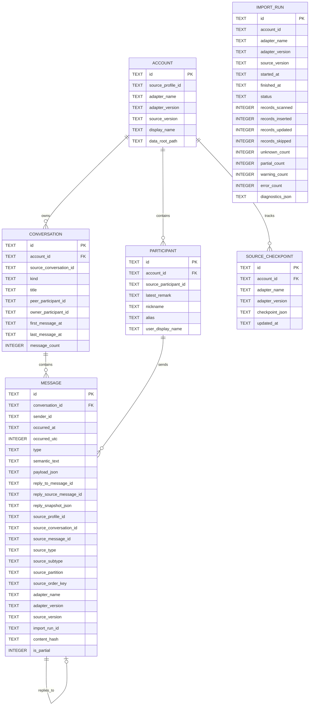

# WeArchive Data Model

## 1. Purpose

The normalized data model decouples the long-lived personal archive from any single upstream client format.

Source adapters may change often. The archive schema should change only when product semantics change.

The canonical message semantics are defined by [MESSAGE_SCHEMA.md](MESSAGE_SCHEMA.md). Phase 1 export behavior is defined by [EXPORT_PRD.md](EXPORT_PRD.md).

## 2. Core principles

1. Stable IDs and display names are separate concepts.
2. Source provenance is first-class.
3. Import runs are auditable.
4. Re-import must be idempotent.
5. Message semantics are source-independent.
6. Binary media is not required for the Phase 1 export product.
7. Source-specific fields belong in provenance/metadata, not in core domain columns unless they have product meaning.
8. Unknown records are retained rather than silently discarded.
9. An import publishes atomically: one conversation's records become part of the archive in a single transaction, and a run that could not read the source completely leaves the archive unchanged instead of storing the records it happened to read.

## 3. Entity relationship overview

This is the shipped archive schema (SQLite, migration 1). Column names and types are normative.



`ConversationParticipant` has no dedicated table in migration 1: a conversation's peer and
owner are referenced directly from `conversations`, and per-participant metadata lives on
`participants`. A full membership relation remains a future schema change.

Indexes:

```text
accounts            unique (adapter_name, source_profile_id)
participants        unique (account_id, source_participant_id)
conversations       unique (account_id, source_conversation_id)
messages            (conversation_id, occurred_utc, source_order_key, id)   -- canonical timeline order
messages            (conversation_id, source_message_id)
messages            (conversation_id, type)
source_checkpoints  unique (account_id, adapter_name)
```

## 4. Account

Represents one logical source profile imported into an archive.

Required concepts:

- internal archive `id`;
- stable `source_profile_id` from adapter;
- adapter identity;
- source/client version metadata;
- optional display label.

An Account is not an authentication credential record.

## 5. Conversation

Represents a private chat, group chat or other supported logical conversation.

Fields:

- stable archive ID;
- account ID;
- stable source conversation ID;
- `kind`: `direct`, `group`, `official`, `system`, `unknown`;
- current title/display name;
- `peer_participant_id` for a direct conversation and `owner_participant_id` where known;
- `message_count`;
- optional user-maintained alias in export configuration;
- optional first/last known timestamps.

Conversation titles are mutable and must never be used as identity keys or physical export paths.

## 6. Participant

Represents a stable logical sender/contact identity when available.

Fields:

- archive ID;
- account ID;
- stable source participant ID;
- latest available remark;
- latest nickname;
- `alias`;
- `user_display_name`.

Phase 1 export identity rules:

```text
latest remark exists -> default display_name = latest remark
no latest remark      -> default display_name = ""
```

Nickname is retained as metadata but does not automatically fill a missing remark. The
user-maintained `display_name_override` in the exported `identities.yaml` is a separate,
export-level hook and wins over the generated default; it is not an archive column.

Display names can change and collide. Stable participant IDs must remain the canonical identity.

## 7. ConversationParticipant

Many-to-many relation between conversations and participants.

Migration 1 does not create a `conversation_participants` table. Today the conversation-to-participant relation is expressed by `conversations.peer_participant_id` and `conversations.owner_participant_id`, and participant metadata is stored on `participants`. A future migration may add a real membership table carrying:

- group nickname;
- role;
- join/leave timing where available.

Group-specific names never replace the canonical participant ID.

## 8. Message

`Message` is the canonical archived semantic event.

Required semantics:

- archive message ID;
- conversation ID;
- sender ID when resolvable;
- canonical timestamp;
- normalized semantic `type`;
- LLM/search-oriented semantic `text`;
- optional type-specific structured `payload`;
- optional reply/reference relationship;
- source provenance;
- import run;
- a semantic `content_hash` for idempotent upserts.

### 8.1 Timestamps and ordering

A message stores its time twice:

- `occurred_at` — ISO-8601 text **with the source's timezone offset** (`yyyy-MM-dd'T'HH:mm:sszzz`), which is what the export publishes and what a human or LLM reads;
- `occurred_utc` — the same instant as epoch seconds (`INTEGER`), which is what the archive orders by and range-queries on.

Storing both avoids re-parsing text on every range query while keeping the exported timestamp
unambiguous. Canonical timeline order is `(occurred_utc, source_order_key, id)`, which is the
index `ix_messages_timeline`. Conversation first/last aggregates and stats are computed from
`occurred_utc` (the epoch) and retain the corresponding rendered `occurred_at`; they never
take `MIN`/`MAX` over the offset-bearing text, which would mis-order records across different
timezone offsets.

### 8.2 Idempotent upsert and `content_hash`

`content_hash` is a SHA-256 over the **semantic** fields only: canonical type, sender, epoch
time, semantic text, payload JSON, the reply's upstream source id, the reply's sender and
text, and the partial flag.

Fields that only carry metadata — for example the refreshed adapter version, source version
or import run id — are deliberately excluded. A re-import of unchanged source data is
therefore recognised as unchanged and does not count as an update, which is what makes
repeated imports idempotent in practice rather than only in primary-key terms.

### 8.3 Common semantic model

The conceptual structure is:

```text
Message
├─ common envelope
│  ├─ id
│  ├─ conversation_id
│  ├─ sender_id
│  ├─ time
│  └─ type
├─ semantic_text
├─ payload
├─ reply_to
└─ source provenance
```

The archive stores the type-specific structure in the `payload_json` column while exports use the canonical shape defined in `MESSAGE_SCHEMA.md`.

### 8.4 Canonical message types

Phase 1 normalized types:

- `text`
- `image`
- `voice`
- `video`
- `file`
- `link`
- `app_share`
- `mini_program`
- `forward_bundle`
- `location`
- `contact_card`
- `system`
- `revoke`
- `red_packet`
- `transfer`
- `emoji`
- `unknown`

`quote` is not a standalone content type. A quoted/replied message uses the underlying content type plus a `reply_to` relationship.

Unknown source records must map to `unknown` with diagnostics and source type metadata; they must not be silently discarded.

### 8.5 Semantic text

Every message should have a compact semantic text representation useful to LLMs and full-text search.

Examples:

```text
text      -> 下午三点开会。
image     -> [图片]
voice     -> [语音]
video     -> [视频]
file      -> [文件] 华东中心项目汇报V8.pptx
link      -> [链接] 标题\nhttps://...
app_share -> [APP分享][来源] 标题\nhttps://...
unknown   -> [未识别消息]
```

Semantic text must not contain unnecessary upstream XML or implementation details.

### 8.6 Structured payload

`payload` contains product-meaningful type-specific semantics, for example:

- file name / extension / size;
- link title / description / original URL;
- app source / app ID / page path;
- voice duration;
- location fields;
- transfer fields;
- forwarded-chat nested items.

Missing fields must not be guessed.

### 8.7 Reply relationship

Replies/quotes are represented structurally. Three columns work together:

- `reply_source_message_id` — the **upstream** id of the referenced record, addressed with the
  composite strategy of section 16.2. It is stored exactly as the adapter supplied it and is
  what makes resolution possible, but it is provenance and is never exported.
- `reply_to_message_id` — the resolved canonical `m_...` id, filled in by the archive when the
  referenced record is present in the same archive (resolved on insert and by a backfill pass
  for records imported later). It is null while the target does not resolve. The archive never
  fabricates a target id. When a re-import changes `reply_source_message_id` (the upstream
  message was edited to quote a different record), the previously-resolved
  `reply_to_message_id` is cleared so the backfill pass re-resolves it against the new target;
  a target that no longer resolves is left null rather than retaining the stale id.
- `reply_snapshot_json` — the locally available quoted sender/text metadata, kept even when no
  canonical target resolves.

This allows reply graph analysis both when the target is archived and when the source only
stored a quote snapshot, or when the target is missing from the local source entirely.

## 9. Non-text events and binary policy

The archive may retain local source metadata needed for diagnostics, but Phase 1 export does not require copying image/audio/video/file binaries.

Product semantics retained include:

- image: event existence;
- video: event existence;
- voice: event existence and duration where reliably available;
- file: original filename and optional metadata;
- emoji/sticker: event existence.

No OCR/ASR/visual derived layer is part of Phase 1.

## 10. Link and app-share semantics

Links and third-party shared content are first-class message semantics.

The normalized payload should preserve, where locally available:

- title;
- description;
- source application;
- original URL;
- wrapper/fallback URL;
- app ID;
- page path.

The system should prefer a confirmed underlying/original URL over a wrapper/tracking URL when that distinction can be determined from local source metadata.

Phase 1 canonical export does not require remote crawling of target webpages.

## 11. Forwarded bundle semantics

Merged/forwarded chat records may contain nested textual events.

The archive should preserve:

- bundle title;
- item count;
- nested sender name;
- nested sender ID only when reliably resolvable;
- nested timestamp;
- nested normalized type;
- nested semantic text.

An unresolvable nested sender must not be assigned a fabricated canonical identity.

## 12. Unknown records

Unknown records are first-class retained events.

Minimum useful information:

- `type = unknown`;
- semantic text `[未识别消息]`;
- upstream type/subtype where available;
- optional compact raw summary;
- normal source provenance.

Diagnostics and manifests must count unknown/partial records.

## 13. ImportRun

Every sync/import invocation creates one ImportRun.

Required fields:

- run ID;
- start/end time;
- account ID;
- adapter name/version;
- source version;
- status;
- records scanned;
- records inserted;
- records updated;
- records skipped;
- warnings count;
- errors count;
- unknown message count;
- partial count;
- structured diagnostic summary (`diagnostics_json`).

This entity is required for operational trust.

`records_scanned` counts the records the run read; the inserted/updated/skipped counters describe
what the run published. A run that was rolled back because source coverage failed publishes
nothing, so it reports zero inserted/updated/skipped while `records_scanned` still shows how far
it read and its Fatal diagnostic says why. Section 2 principle 9, docs/ARCHITECTURE.md section 3.2.1.

Every conversation a run publishes is committed in one transaction together with its messages, so
the conversation row and its aggregates never describe records the archive does not hold.

## 14. SourceCheckpoint

Stores adapter-owned incremental state.

Schema fields:

- `id`;
- `account_id`;
- `adapter_name` / `adapter_version`;
- `checkpoint_json` — the opaque, versioned payload;
- `updated_at`.

Rules:

- payload is versioned;
- payload is opaque to the generic importer;
- checkpoint update occurs only after durable archive commit;
- adapter version changes may invalidate prior checkpoints;
- uniqueness is `(account_id, adapter_name)`.

**Status:** the table exists in migration 1, but the MVP importer does **not** read or advance checkpoints. Every import reads the full conversation and relies on `content_hash` idempotency instead. Incremental refresh is M1 completion work.

## 15. SourceArtifact / provenance

Minimum provenance fields for Message where available:

```text
source_profile_id
source_conversation_id
source_message_id
source_type
source_subtype
source_partition
source_order_key
adapter_name
adapter_version
source_version
import_run_id
```

All of these exist as columns on `messages`. Provenance is not the primary downstream analysis interface but must support reprocessing and diagnostics.

## 16. Identity strategy

Archive IDs are deterministic. Every stable ID is a namespace prefix plus the first **16 hex
characters (64 bits)** of `SHA-256` over the length-prefixed, concatenated namespace parts.

```text
a_<16 hex>   account      SHA-256("account", adapter_name, source_profile_id)
u_<16 hex>   participant  SHA-256("user", account_id, source_user_id)
g_<16 hex>   group        SHA-256("group", account_id, source_room_id)
m_<16 hex>   message      SHA-256("message", conversation_id, source_message_id)
```

A direct conversation's stable ID **is** its peer's `u_...` ID — the same peer in the same
account always yields the same ID whether it is addressed as a conversation or as a person.

Mutable human names (remarks, nicknames, group titles) are never inputs, which is what makes
physical export paths survive renames.

### 16.1 Why 16 hex characters, not 8

Earlier illustrative examples in these documents showed 8-character prefixes. The
implementation uses 16 because a 32-bit prefix collides measurably at archive scale: the
birthday bound puts a 50% collision probability at roughly 77,000 ids, which a single large
message archive exceeds. 64 bits moves that bound far beyond any personal archive while
keeping IDs short enough to read and to use as folder names.

### 16.2 Composite upstream message identity

When upstream has no stable message id, the adapter supplies a documented composite instead of
a content hash, because repeated identical messages are valid data:

```text
server id present -> s:<server_id>
otherwise         -> l:<partition>:<local_id>
```

`partition` identifies the upstream shard the record came from, so the composite stays unique
across a multi-shard timeline.

A record for which the adapter can provide neither form of identity is a source-coverage
failure. The importer records a Fatal diagnostic and the workflow does not export a reduced
dataset; it never skips that record or invents an identity, and the run publishes nothing to the
archive (section 2 principle 9).

## 17. Deduplication

Deduplication prefers stable source identity over content heuristics.

The archive's idempotency mechanism is the primary key together with `content_hash`: an upsert
whose semantic hash is unchanged is a no-op, while a real semantic change is recorded as an
update. Fallback content-based deduplication is not used, because repeated identical messages
are valid data.

## 18. Schema evolution

- Use numbered database migrations.
- Every applied migration is recorded in `schema_migrations (version, description, applied_at)`.
- The current schema version is also mirrored into SQLite's `user_version` pragma.
- Migrations are forward-only and idempotent: a re-open of an up-to-date archive applies nothing.
- Never mutate production archives without migration records.
- Backward-incompatible archive changes require a documented migration path.
- Export and message schemas are independently versioned in `manifest.json`.

Migration 1 (`initial canonical archive schema`) is the current version.

## 19. Search indexing

Full-text search is a derived index, not the canonical store.

The FTS index should be rebuildable from normalized `semantic_text` and selected structured payload fields such as filenames, link titles and descriptions.

No FTS index exists in migration 1; search is M3 work.

## 20. Raw source retention

Raw source records are optional and should not be required for normal archive/export workflows.

If retained for debugging/reproducibility:

- store separately from canonical semantic columns;
- mark source format/version;
- allow disabling retention;
- avoid placing large opaque blobs in the core Message table.

## 21. Raw Vault data model

The Raw Vault is a separate persistence layer from the canonical SQLite archive. It has its own
independently versioned format (`manifest_version` and `vault_format_version`, both currently
`1`), and no canonical SQLite migration is required to introduce it (Issue #22, migration-1
`source_checkpoints` remains untouched).

Conceptual entities:

```text
RawVaultAccount  — one captured source profile (identified by the same stable account id
                   used by the canonical archive, a_<16-hex>)
RawGeneration    — one published snapshot; logically immutable; identified by gen_<16-hex>
RawArtifact      — one content object (e.g. a decrypted source database image)
CaptureRun       — provenance embedded in the manifest: adapter family/version, capture
                   time, completeness, diagnostics
```

### 21.1 Generation identity

`gen_<16-hex>` is `SHA-256("generation", account_id, capture_time_utc_iso8601,
capture_adapter_family, capture_adapter_version)` truncated to 16 hex characters (64 bits),
matching the canonical archive's identity-derivation rules (section 16). Two captures of the
same account at different times yield different generation ids.

### 21.2 Physical layout

```text
<vault-root>/accounts/<account-id>/generations/<generation-id>/
  manifest.json
  artifacts/<sha256><ext>
```

### 21.3 Manifest

The manifest is a versioned JSON document recording source product/version, source profile,
capture adapter family/version, capture time, mode (`baseline`), completeness, every artifact's
role/name/content-ref/SHA-256/size, diagnostics and the previous generation id (append-only
chain). See [RAW_VAULT.md](RAW_VAULT.md) for the full manifest shape.

The manifest format version is independent of the canonical SQLite schema version
(section 18), the message-schema version and the export-schema version.

### 21.4 Artifact roles and checksums

Artifact `role` values are source-neutral strings (e.g. `source-database`) so the Raw Vault does
not leak WeChat table names into Core/CLI. Every artifact has a verifiable SHA-256 checksum;
opening a generation re-verifies every checksum and rejects tampered or corrupted artifacts.

### 21.5 Raw Vault format-version tests

Raw Vault format-version tests must verify that `manifest_version = 1` can be reopened
independently of the capture process — i.e. a new `RawVaultStore` instance pointing at the same
root can discover and validate a published generation without the capture adapter being alive.

### 21.6 No canonical migration

The canonical `archive/wearchive.db` schema is unchanged in M1.5. The Raw Vault introduces no
SQLite migration. The Raw Vault format version is tracked in each manifest, not in
`schema_migrations`.
