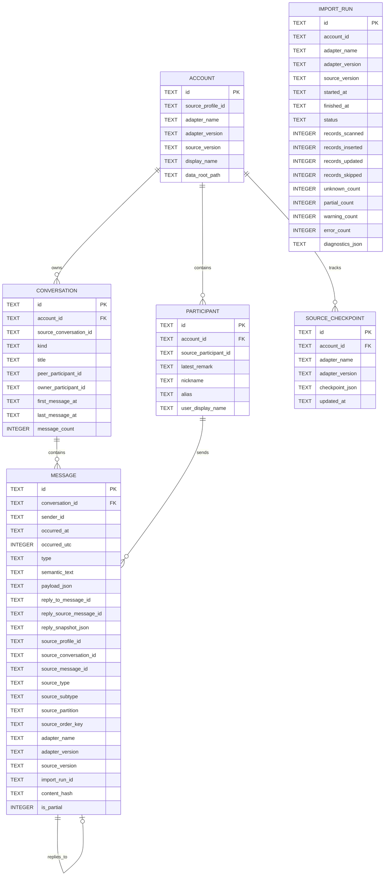

# WeArchive Data Model

## 1. Purpose

WeArchive has two different persistent-data concerns:

1. **Raw Vault preservation model** — source-faithful, versioned evidence used for recovery/rebuild;
2. **canonical archive model** — stable source-independent entities used by query/export/Harness workflows.

They must not be collapsed into one schema.

The canonical model decouples long-lived product semantics from upstream WeChat formats. The Raw Vault preserves enough source evidence to let future readers/parsers reinterpret history when source formats or parser understanding change.

Canonical message semantics are defined by [MESSAGE_SCHEMA.md](MESSAGE_SCHEMA.md). Preservation/rebuild is defined by [RAW_VAULT.md](RAW_VAULT.md).

## 2. Core principles

1. Raw Vault is the archival source of truth; canonical SQLite is the operational system of record.
2. Stable IDs and display names are separate concepts.
3. Source provenance is first-class.
4. Re-ingest/rebuild is idempotent.
5. Message semantics are source-independent.
6. Unknown source fields/records are not discarded merely because the current parser cannot interpret them.
7. Source-specific fields stay in Raw Vault/provenance rather than leaking into canonical columns unless they have product meaning.
8. Capture and canonical-ingest progress are separate checkpoint domains.
9. Canonical IDs must remain deterministic across parser upgrades and rebuilds for unchanged source identities.
10. Binary media preservation remains separately scoped; Raw Vault database preservation does not automatically imply complete image/audio/video/file asset backup.

## 3. Shipped canonical schema — migration 1

The following is the currently shipped canonical SQLite schema. Column names/types remain normative for migration 1 until an explicit migration changes them.



Current indexes:

```text
accounts            unique (adapter_name, source_profile_id)
participants        unique (account_id, source_participant_id)
conversations       unique (account_id, source_conversation_id)
messages            (conversation_id, occurred_utc, source_order_key, id)
messages            (conversation_id, source_message_id)
messages            (conversation_id, type)
source_checkpoints  unique (account_id, adapter_name)
```

`ConversationParticipant` has no dedicated migration-1 table. Peer/owner relations are stored on `conversations`; richer membership remains a future schema change.

## 4. Canonical entity semantics

### 4.1 Account

Represents one logical source profile imported into the canonical archive.

Required concepts:

- stable archive ID;
- stable `source_profile_id`;
- logical adapter/source family;
- adapter/reader/source version metadata;
- optional human display label.

Account is not a credential/key record.

### 4.2 Conversation

Represents one logical direct/group/official/system/unknown conversation.

Fields include:

- stable canonical ID;
- account ID;
- stable source conversation ID;
- kind;
- mutable title/display name;
- peer/owner references where known;
- message count and first/last known timestamps.

Mutable names never define identity or physical export paths.

### 4.3 Participant

Represents a stable logical sender/contact identity where available.

Display metadata (`latest_remark`, `nickname`, aliases/overrides) may change without changing stable ID.

### 4.4 Message

`Message` is the canonical semantic event used by query/export/Harness workflows.

Required semantics:

- stable archive message ID;
- conversation/sender references;
- canonical time/order;
- normalized semantic type/text/payload;
- reply relationship;
- source provenance;
- import-run reference;
- semantic `content_hash` for idempotent updates.

## 5. Timestamps and ordering

Messages store:

- `occurred_at` — ISO-8601 text with source timezone offset;
- `occurred_utc` — epoch seconds for range filtering/order.

Canonical timeline order remains:

```text
(occurred_utc, source_order_key, id)
```

`occurred_utc` exists specifically to support efficient date/range/context queries without reparsing offset-bearing strings.

## 6. Idempotent upsert and content hash

`content_hash` represents semantic message content rather than transient importer metadata.

A repeated ingest of the same preserved source record is a no-op when semantic content has not changed. A real reinterpretation/semantic correction may update the canonical record while keeping its stable message ID.

This is important for Raw Vault rebuild/parser upgrades: improved parsers can produce richer canonical semantics without manufacturing a new logical message identity.

## 7. Canonical message model

```text
Message
├─ common envelope
│  ├─ id
│  ├─ conversation_id
│  ├─ sender_id
│  ├─ time
│  └─ type
├─ semantic_text
├─ payload
├─ reply_to
└─ source provenance
```

Phase-1 canonical types remain:

- `text`
- `image`
- `voice`
- `video`
- `file`
- `link`
- `app_share`
- `mini_program`
- `forward_bundle`
- `location`
- `contact_card`
- `system`
- `revoke`
- `red_packet`
- `transfer`
- `emoji`
- `unknown`

`quote` is a relationship, not a standalone content type.

## 8. Semantic text and structured payload

`semantic_text` is compact text useful to humans, FTS and LLM/Harness retrieval, for example:

```text
text      -> 下午三点开会。
image     -> [图片]
voice     -> [语音]
file      -> [文件] 华东中心项目汇报V8.pptx
link      -> [链接] 标题\nhttps://...
unknown   -> [未识别消息]
```

`payload_json` carries product-meaningful structured semantics such as filename, link title/description/URL, app ID/page path, duration, location, transfer fields and forwarded nested items.

Missing values are never fabricated.

## 9. Reply relationship

Three canonical concepts remain:

- `reply_source_message_id` — preserved upstream identity used for resolution;
- `reply_to_message_id` — resolved stable canonical target where available;
- `reply_snapshot_json` — locally available quoted sender/text snapshot.

A rebuild may re-resolve reply graphs as more target records become available, but stable IDs remain deterministic.

## 10. Unknown source evidence

Canonical unknown messages remain first-class retained events:

```text
type = unknown
semantic_text = [未识别消息]
source type/subtype/provenance retained where available
```

The Raw Vault adds a stronger guarantee upstream of this canonical representation: unrecognized source fields/records remain preserved in source-faithful evidence so a future reader can reinterpret them.

Canonical `unknown` therefore means "current parser does not have a stable semantic interpretation", not "the original evidence was discarded".

## 11. ImportRun

Migration-1 `ImportRun` records canonical ingestion activity.

Required concepts include:

- run ID;
- account/source/adapter versions;
- start/end/status;
- scanned/inserted/updated/skipped counters;
- unknown/partial/warning/error counts;
- structured diagnostics.

As Raw Vault is implemented, capture publication needs its own durable audit/generation metadata rather than overloading `ImportRun` with both capture and ingest semantics.

## 12. Raw Vault model

Raw Vault is not represented by the canonical `Message` table and should not be forced into migration-1 schema.

The preservation model is generation-based.

Conceptual entities:

```text
RawVaultAccount
RawGeneration
RawArtifact / ContentObject
CaptureRun
CaptureCheckpoint
```

A generation records at least:

- generation identifier/sequence;
- source profile/account identity;
- capture time;
- source product/client version;
- logical adapter/capture family and implementation version;
- source-format/schema evidence needed to select a future reader;
- artifact/content references and checksums;
- completeness state and diagnostics.

The exact physical storage format may use files, SQLite catalogs, content-addressed objects or deduplicated chunks. That implementation detail is not a Harness/query API.

See [RAW_VAULT.md](RAW_VAULT.md).

## 13. Raw Vault immutability and deletion semantics

Published generations are logically immutable.

If a record/source partition disappears later from live WeChat, earlier preserved generations remain intact.

```text
source absence != preservation deletion
```

Any destructive purge/retention operation must be explicit and separately specified.

## 14. Capture checkpoint (target)

Capture checkpoint tracks live-source acquisition progress into Raw Vault.

Conceptually it may need account/partition-specific cursors such as source order keys, file/page/change evidence or generation lineage.

Rules:

- advances only after successful Raw Vault generation publication;
- versioned and capture-adapter-owned;
- invalidation/fallback to wider capture is explicit;
- never causes deletion of older preserved evidence.

## 15. Ingest checkpoint (target)

Ingest checkpoint tracks processing of preserved Raw Vault evidence into canonical SQLite.

Preferred logical scope:

```text
account
  + logical adapter/source family
  + conversation
  + optional partition/generation cursor(s)
```

This permits:

- conversation A to advance while conversation B fails;
- Collection sync to update each conversation independently;
- parser repair followed by replay from preserved generations;
- rebuild/import without querying live WeChat.

A future migration may model this explicitly, for example with fields equivalent to:

```text
account_id
adapter_family
scope_kind       # conversation, account, ...
scope_id
checkpoint_json
updated_at
UNIQUE(account_id, adapter_family, scope_kind, scope_id)
```

This is a target model, not the shipped migration-1 schema.

## 16. Relationship to migration-1 SOURCE_CHECKPOINT

The current `source_checkpoints` table is:

```text
id
account_id
adapter_name
adapter_version
checkpoint_json
updated_at
UNIQUE(account_id, adapter_name)
```

Status:

- it exists in migration 1;
- the current importer does not consume/advance it;
- its account+adapter granularity is insufficient for the accepted target model of separate capture and conversation-scoped ingest progress.

Implementation work must add a documented migration rather than silently repurpose the existing table with incompatible semantics.

## 17. Source provenance in canonical messages

Canonical messages retain where available:

```text
source_profile_id
source_conversation_id
source_message_id
source_type
source_subtype
source_partition
source_order_key
adapter_name
adapter_version
source_version
import_run_id
```

Provenance supports traceability and canonical rebuild diagnostics, but it is not a substitute for Raw Vault preservation of source evidence.

## 18. Identity strategy

Stable IDs remain deterministic namespace hashes over source identities.

```text
a_<16 hex>   account      SHA-256("account", adapter_family, source_profile_id)
u_<16 hex>   participant  SHA-256("user", account_id, source_user_id)
g_<16 hex>   group        SHA-256("group", account_id, source_room_id)
m_<16 hex>   message      SHA-256("message", conversation_id, source_message_id)
```

The first 16 hex characters (64 bits) are used.

A direct conversation ID remains the peer `u_...` ID under the current identity contract.

### 18.1 Rebuild invariant

Reader/parser implementation versions MUST NOT create new identity namespaces.

For example:

```text
wechat-windows            logical source/adapter family used in identity
reader/parser v1/v2/v3    metadata, not identity namespace
```

Given the same preserved source identities, rebuild must reproduce the same account/participant/conversation/message IDs.

### 18.2 Composite upstream message identity

Preferred upstream message identity remains:

```text
server id present -> s:<server_id>
otherwise         -> l:<partition>:<local_id>
```

Content hashes are not fallback identities because repeated identical messages are valid data.

If preserved evidence cannot provide a documented stable/composite source identity required by the canonical contract, that is a coverage/identity failure; the importer does not invent one merely to continue.

## 19. Deduplication

Canonical deduplication prefers stable source identity plus semantic `content_hash`.

Raw Vault physical deduplication is a separate storage optimization. It may use content-addressed objects/chunks while preserving immutable logical generations.

Do not confuse physical storage deduplication with logical message deduplication.

## 20. Search indexing

Full-text search is derived canonical state, not preservation state.

Target FTS should be rebuildable entirely from canonical SQLite and may index:

- `semantic_text`;
- filenames;
- link/app-share titles/descriptions;
- other explicitly selected canonical payload text.

No FTS index exists in migration 1; this remains target query work.

## 21. Query model

Harness/Agent access uses source-independent query DTOs exposed by `ArchiveQueryService`.

Normal callers should not rely on:

- Raw Vault tables/files;
- migration-1 SQLite column layout;
- WeChat source schemas.

Pagination cursors are opaque product contracts.

See [HARNESS.md](HARNESS.md).

## 22. Collection model

Collection is the named reusable set of conversation stable IDs used across sync/query/Harness/export scopes.

Collection configuration/metadata should reference canonical stable IDs, so canonical rebuild must preserve those IDs.

## 23. Export relationship

JSONL/YAML/JSON exports are generated from canonical archive semantics.

They are not inputs required to rebuild the canonical archive and are not substitutes for Raw Vault preservation.

```text
Raw Vault      -> rebuild -> canonical SQLite
canonical SQLite -> export -> JSONL/YAML/JSON
```

## 24. Schema evolution

Canonical SQLite rules remain:

- numbered forward migrations;
- applied migrations recorded in `schema_migrations`;
- `user_version` mirrors canonical schema version;
- re-open of an up-to-date archive applies nothing;
- backward-incompatible changes require a documented migration path.

Raw Vault format/manifests are independently versioned from canonical SQLite and export/message schemas.

A canonical schema migration must not mutate Raw Vault historical evidence.

## 25. Rebuild semantics and migrations

Because canonical SQLite is rebuildable, there are two legitimate upgrade paths:

1. **in-place canonical migration** for normal product upgrades;
2. **fresh rebuild from Raw Vault** when explicitly requested/required.

A rebuild is not permission to lose user-maintained canonical/configuration metadata. Aliases/Collections/overrides that are not derivable from Raw Vault need their own durable configuration/migration strategy so they can be reapplied to a rebuilt archive.

Implementation issues must identify which user-maintained state lives outside rebuildable canonical data.

## 26. Media boundary

Initial Raw Vault work preserves supported source database evidence needed to reconstruct canonical message records/provenance.

It does not automatically guarantee that all external media/file payload bytes are archived.

A future media-preservation model must separately define:

- asset identity;
- deduplication;
- source disappearance semantics;
- encryption/privacy;
- message-to-asset references;
- rebuild/export behavior.

## 27. Current and target summary

```text
CURRENT 0.2.x
live WeChat -> parser/normalizer -> migration-1 canonical SQLite -> export

TARGET
live WeChat -> Raw Vault -> versioned reader/parser -> canonical SQLite
                                      │
                                      └-> improved parser can rebuild history
canonical SQLite -> QueryService/FTS -> CLI/MCP/Harness
canonical SQLite -> JSONL export
```

The target adds preservation/rebuild capability without replacing the canonical schema's role in daily query/export operations.